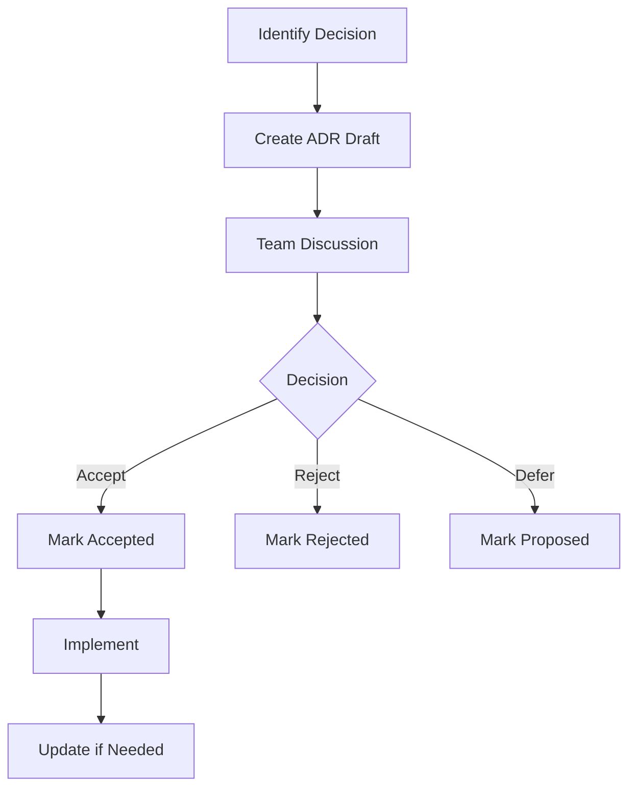

# Architecture Decision Records

This directory contains Architecture Decision Records (ADRs) that document the key architectural decisions made during the development of the Personal Assistant Backend.

## What are ADRs?

Architecture Decision Records are documents that capture important architectural decisions along with their context and consequences. They serve as:

- **Historical Record**: Documenting why decisions were made
- **Knowledge Base**: Sharing architectural knowledge with the team
- **Design Guidelines**: Providing guidance for future development
- **Technical Debt Tracker**: Identifying areas that may need refactoring

## ADR Template

Each ADR follows this template:

```markdown
# [Number]. [Title]

Date: [YYYY-MM-DD]

## Status

[Proposed | Accepted | Deprecated | Superseded by [ADR-XXX]]

## Context

[Describe the context and forces at play]

## Decision

[Describe the decision made]

## Consequences

[Describe the positive and negative consequences]

## Alternatives Considered

[List alternative solutions and why they were rejected]

## Related ADRs

[Reference related ADRs if any]
```

## Current ADRs

| ADR | Title | Status | Date |
|-----|-------|--------|------|
| [ADR-001](001-async-first-architecture.md) | Async-First Architecture | Accepted | 2024-01-XX |
| [ADR-002](002-dependency-injection-pattern.md) | Dependency Injection Container | Accepted | 2024-01-XX |
| [ADR-003](003-protocol-based-interfaces.md) | Protocol-Based Interfaces | Accepted | 2024-01-XX |
| [ADR-004](004-websocket-streaming-api.md) | WebSocket Streaming API | Accepted | 2024-01-XX |
| [ADR-005](005-tool-sdk-design.md) | Tool SDK Design | Accepted | 2024-01-XX |
| [ADR-006](006-memory-vector-storage.md) | Memory Vector Storage | Accepted | 2024-01-XX |
| [ADR-007](007-plugin-system-architecture.md) | Plugin System Architecture | Accepted | 2024-01-XX |
| [ADR-008](008-multi-provider-llm-support.md) | Multi-Provider LLM Support | Accepted | 2024-01-XX |

## Categories

### Core Architecture
- ADR-001: Async-First Architecture
- ADR-002: Dependency Injection Container
- ADR-003: Protocol-Based Interfaces

### Communication
- ADR-004: WebSocket Streaming API

### Extensibility
- ADR-005: Tool SDK Design
- ADR-007: Plugin System Architecture
- ADR-008: Multi-Provider LLM Support

### Data Management
- ADR-006: Memory Vector Storage

## How to Create an ADR

1. **Identify the Decision**: Recognize when you're making a significant architectural choice

2. **Create the ADR**: Copy the template and fill in the details

3. **Get Feedback**: Share with the team for discussion

4. **Accept and Implement**: Implement the decision and mark as Accepted

5. **Update as Needed**: Mark as Deprecated or Superseded when circumstances change

## ADR Workflow



## Guidelines

### When to Write an ADR

Write an ADR when:

- Making a significant architectural change
- Choosing between multiple technical approaches
- Establishing new patterns or standards
- Making trade-offs that affect future development
- Resolving technical debt or design issues

### What to Include

Each ADR should include:

- **Clear Context**: What problem are you solving?
- **Explicit Decision**: What exactly was decided?
- **Rationale**: Why was this decision made?
- **Consequences**: What are the positive and negative impacts?
- **Alternatives**: What other options were considered?

### ADR Maintenance

- Keep ADRs current as the system evolves
- Mark deprecated ADRs when they're no longer relevant
- Reference superseded ADRs in new decisions
- Use ADRs as a teaching tool for new team members

## Tools and Templates

### ADR Template Script

```bash
#!/bin/bash
# create_adr.sh

if [ $# -lt 1 ]; then
    echo "Usage: $0 <title>"
    exit 1
fi

TITLE=$1
DATE=$(date +%Y-%m-%d)
NUMBER=$(ls *.md 2>/dev/null | wc -l)
NUMBER=$((NUMBER + 1))
FILENAME=$(printf "%03d-%s.md" $NUMBER "$(echo $TITLE | tr ' ' '-' | tr '[:upper:]' '[:lower:]')")

cat > "$FILENAME" << EOF
# $NUMBER. $TITLE

Date: $DATE

## Status

Proposed

## Context

[Describe the context and forces at play]

## Decision

[Describe the decision made]

## Consequences

[Describe the positive and negative consequences]

## Alternatives Considered

[List alternative solutions and why they were rejected]

## Related ADRs

[Reference related ADRs if any]
EOF

echo "Created ADR: $FILENAME"
```

### ADR Review Checklist

- [ ] Context clearly explains the problem
- [ ] Decision is specific and actionable
- [ ] Consequences (both positive and negative) are listed
- [ ] Alternatives are considered and reasons for rejection given
- [ ] Decision aligns with project goals and constraints
- [ ] ADR is written clearly and concisely
- [ ] Related ADRs are referenced if applicable
