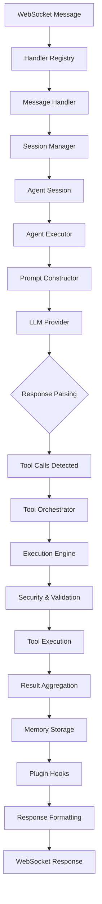
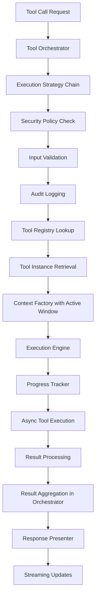
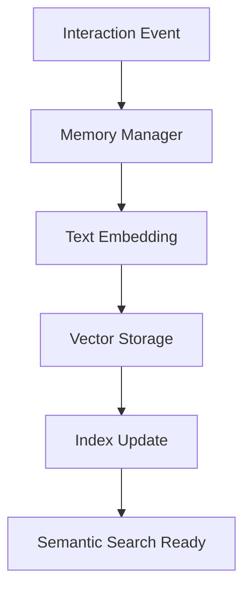

# Architecture Overview

This document provides a comprehensive overview of the Personal Assistant Backend architecture, including design principles, component structure, and data flow patterns.

## Design Principles

### Clean Architecture
The system follows Clean Architecture principles with clear separation of concerns:

- **Domain Layer**: Core business logic (Agent, Tools, Memory)
- **Application Layer**: Use cases and orchestration (Executors, Orchestrators)
- **Infrastructure Layer**: External dependencies (LLM providers, storage, APIs)
- **Interface Layer**: Entry points (WebSocket API, CLI)

### Dependency Injection
- Uses `dependency-injector` for clean dependency management
- Container composition organizes dependencies by domain
- Proper separation between configuration and runtime dependencies

### Asynchronous Design
- Fully async/await throughout the system
- Non-blocking I/O operations
- Event-driven architecture with message bus

## Core Components

### Agent System (`src/agent/`)

The agent system manages conversation sessions and orchestrates task execution with comprehensive session management:

- **AgentSession**: Core session class managing conversation state, memory integration, and tool orchestration (requires EventBus injection)
- **AgentExecutor**: Handles query processing, LLM interaction, and tool execution coordination (requires EventBus injection)
- **InteractionLoop**: Core agent loop implementing ReAct pattern (prompt → LLM → parse → tools → repeat)
- **ResponsePresenter**: Presentation layer for enriching domain events with UI metadata (separated from core logic)
- **SessionManager**: Manages multiple concurrent user sessions with WebSocket integration
- **ConversationHistory**: Maintains conversation state with configurable history limits and cached `last_user_query` property
- **ResultProcessor**: Processes and formats execution results for client consumption
- **Plugin System**: Extensible hooks for agent lifecycle events (instruction, LLM response, tool execution)
- **State Management**: Tracks agent execution state and provides status updates

**Enhanced Data Flow**:
```
WebSocket Message → SessionManager → AgentSession → AgentExecutor → LLM Client → Tool Orchestrator → Plugin Hooks → Memory Manager → Response Formatter → WebSocket Stream
```

**Key Features:**
- Multi-user concurrent session support
- Real-time streaming responses via WebSocket
- Memory integration with episodic and semantic storage
- Plugin extensibility at multiple execution points
- Configurable conversation history management
- Error handling and recovery mechanisms

### Tool System (`src/tools/`)

Enterprise-grade tool management system with security, validation, and marketplace integration:

- **Tool Registry**: Central registry with marketplace and filesystem tool discovery
- **Tool Loader**: Dynamic loading system with instantiation and validation
- **Tool Orchestrator**: Coordinates complex multi-tool executions with progress tracking and result aggregation
- **Tool Execution Engine**: Secure execution environment with strategy pattern
- **Execution Strategies**: Chain of responsibility with security, validation, and audit layers
- **Batch Executor**: Parallel execution with configurable concurrency and dependency resolution
- **Progress Tracker**: Real-time streaming updates with cancellation and timeout support
- **Schema Registry**: Caching system for tool JSON schemas with automatic invalidation
- **Marketplace Manager**: Community tool distribution with security validation
- **Tool Categorization**: Domain-based organization (filesystem, system, web, etc.)
- **Security Framework**: Tool execution sandboxing with permission controls
- **Context Factory**: Execution context creation with dependency injection

**Enhanced Tool Lifecycle**:
```
Discovery (Filesystem + Marketplace) → Loading → Validation → Schema Generation → Security Check → Context Creation → Execution Strategy Chain → Parallel/Batch Processing → Result Aggregation → Streaming Response
```

**Key Components:**
- **50+ Built-in Tools**: Filesystem, system, computer control, web tools
- **Marketplace Integration**: Community tool sharing and installation
- **Security Sandboxing**: Restricted execution environment
- **Streaming Progress**: Real-time execution updates
- **Batch Processing**: Parallel tool execution with dependency management
- **Error Recovery**: Graceful handling of partial failures

### Memory System (`src/memory/`)

Advanced vector-based memory system with episodic and semantic storage:

- **Memory Manager**: High-level interface coordinating memory operations across users/sessions
- **Embeddings Service**: Text vectorization using configurable sentence transformers
- **Storage Layer**: SQLite-based vector storage with async operations and connection pooling
- **Retrieval Engine**: Hybrid search combining semantic similarity and recent episodic memory
- **Summarization Service**: LLM-powered conversion of episodic memories to semantic knowledge
- **Memory Store Interface**: Abstract storage backend supporting multiple implementations
- **Vector Storage**: Efficient vector indexing with metadata filtering and time-based queries

**Memory Architecture**:
```
Episodic Memory (Raw Interactions) → Summarization → Semantic Memory (Facts & Knowledge)
                                      ↓
                            Hybrid Retrieval (Semantic + Recent Episodic)
```

**Key Features:**
- **Dual Memory Types**: Episodic (conversation history) and semantic (knowledge base)
- **Vector Embeddings**: Sentence transformer-based text vectorization
- **Hybrid Search**: Combines semantic relevance with recency weighting
- **Automatic Summarization**: LLM-powered knowledge extraction from conversations
- **Session Isolation**: User and session-scoped memory management
- **Async Operations**: Non-blocking memory operations with proper concurrency control

### LLM Integration (`src/llm/`)

Enterprise-grade multi-provider LLM abstraction with comprehensive feature support:

- **LLMClient**: Unified interface delegating to provider-specific implementations
- **Provider Abstraction**: Clean separation between interface and provider implementations
- **Supported Providers**: OpenAI, Anthropic, Gemini, Ollama, OpenRouter, Mistral, LMStudio, and more via LiteLLM
- **PromptConstructor**: Dynamic prompt engineering with tool schemas, memory context, and system instructions
- **ResponseParser**: Robust parsing of structured outputs and tool call extraction
- **Model Configuration**: Comprehensive model management with provider-specific settings and capabilities
- **Streaming Support**: Real-time response streaming with **typed StreamingEvent objects** (not dictionaries)
- **Rate Limiting**: Built-in rate limiting and retry logic with exponential backoff
- **Error Handling**: Provider-specific error handling with graceful degradation
- **Cost Tracking**: Optional usage and cost monitoring across providers

**LLM Pipeline**:
```
Query + Context → Prompt Construction (with PromptMetadata) → Provider Selection → Streaming Response (StreamingEvent objects) → Tool Call Parsing → Execution Coordination
```

**Key Features:**
- **7+ LLM Providers**: Support for major providers with unified interface
- **Type-Safe Events**: All providers yield `StreamingEvent` objects (ChunkEvent, ThinkingEvent, ErrorEvent)
- **Dynamic Provider Switching**: Runtime provider selection based on configuration
- **Advanced Prompting**: Tool schemas, memory integration, and system context with typed `PromptMetadata`
- **Streaming Responses**: Real-time output with proper WebSocket integration
- **Error Recovery**: Automatic retry with provider fallback options
- **Model Flexibility**: Support for various model sizes and capabilities per provider

**Type Safety Improvements:**
- All LLM providers return typed `StreamingEvent` objects instead of dictionaries
- `PromptMetadata` dataclass replaces dictionary-based metadata
- `isinstance()` checks instead of string-based type checking
- Eliminated all `event.get("type")` patterns

### API Layer (`src/api/`)

Production-ready FastAPI-based real-time API with comprehensive message handling:

- **WebSocket Routes**: Real-time bidirectional communication with connection management
- **MessageHandler**: Abstract base class defining handler interface with validation
- **MessageHandlerRegistry**: Centralized registry with middleware support and routing
- **Handler Implementations**: Query, ping, settings, model listing, and TTS handlers
- **Response Formatter**: Structured response formatting with streaming support
- **TTS Manager**: Integrated text-to-speech with audio streaming capabilities
- **Session Management**: WebSocket session lifecycle with user context and cleanup
- **Error Handling**: Comprehensive error handling with client feedback and logging
- **Message Validation**: Runtime validation using Pydantic schemas and custom validators
- **Query Processing**: End-to-end query pipeline with streaming responses

**Message Flow**:
```
WebSocket Connection → Handshake → Message Routing → Handler Execution → Validation → Processing → Streaming Response
```

**Key Features:**
- **Real-time Streaming**: WebSocket-based streaming for all operations
- **Handler Registry**: Extensible message routing with middleware support
- **TTS Integration**: Audio streaming with voice selection and queue management
- **Error Recovery**: Graceful error handling with detailed client feedback
- **Validation Layer**: Multi-level validation (schema, business logic, security)
- **Session Tracking**: User session management with automatic cleanup

## Infrastructure Components

### Caching Layer (`src/core/cache.py`)

Multi-level caching system for performance optimization:

- **Embedding Cache**: Avoids recomputing text embeddings for identical content using hash-based keys
- **Schema Cache**: Caches tool JSON schemas with automatic invalidation on tool changes
- **Query Cache**: Caches frequent memory retrieval queries with configurable TTL
- **Thread-Safe Operations**: Atomic cache operations supporting concurrent multi-user access
- **Statistics Tracking**: Hit/miss ratios and performance metrics for monitoring

**Key Benefits**:
- Significant reduction in LLM API calls through embedding reuse
- Faster tool schema generation and validation
- Improved memory retrieval performance
- Foundation for future distributed caching (Redis-compatible interface)

### Dependency Injection Container (`src/core/container/`)

Enterprise-grade dependency injection system with domain-driven composition:

- **ApplicationContainer**: Main composition container orchestrating all functional domains
- **CoreContainer**: Foundation services (config, LLM providers, TTS, workspace, security)
- **ToolContainer**: Complete tool ecosystem (registry, loader, orchestrator, marketplace)
- **MemoryContainer**: Memory system (embeddings, storage, retrieval, summarization)
- **ContainerInitializer**: Async initialization coordinator with proper dependency order
- **ContainerConfigUpdater**: Runtime configuration updates with cascading dependency updates
- **AgentSessionFactory**: Factory for creating fully configured agent sessions
- **ContextFactory**: Tool execution context creation with dependency injection
- **SessionFactory**: Session management factory with plugin integration

**Container Architecture**:
```
ApplicationContainer
├── CoreContainer (config, LLM, services)
├── ToolContainer (registry, orchestrator, marketplace)
└── MemoryContainer (embeddings, storage, retrieval)
```

**Key Features:**
- **Domain Separation**: Clean boundaries between functional areas
- **Async Initialization**: Proper initialization order with async dependencies
- **Runtime Reconfiguration**: Dynamic config updates with dependency cascading
- **Factory Pattern**: Centralized object creation with dependency injection
- **Testability**: Container overrides for comprehensive testing
- **Type Safety**: Full type hints and validation throughout

### Configuration Management (`src/core/config/`, `src/core/config_service.py`)

Pydantic-based configuration system with validation and change management:

- **AppConfig**: Comprehensive Pydantic model for all application settings
- **LLMProviders**: Nested configuration for all supported LLM providers
- **ConfigManager**: Core configuration loading from multiple sources
- **ConfigService**: Unified configuration access and validation
- **ConfigSubscriptionManager**: Event-driven configuration change notifications
- **Validation**: Runtime validation with detailed error messages
- **Environment Integration**: Environment variable support and overrides
- **Type Safety**: Full type hints and validation throughout

### Event System (`src/core/events.py`, `src/core/bus.py`)

Asynchronous event-driven communication with dependency injection:

- **EventBus**: Central event dispatcher (injected via `CoreContainer`, not global singleton)
- **Event Types**: Strongly typed events (InteractionCompleted, ConfigChanged, etc.)
- **Subscriptions**: Component-level event handling with priority support
- **Async Processing**: Non-blocking event processing with error recovery
- **Dependency Injection**: EventBus is injected via constructor for testability

**Usage Pattern:**
```python
# ✅ CORRECT: Inject EventBus via constructor
class MyService:
    def __init__(self, event_bus: EventBus):
        self.event_bus = event_bus
        self.event_bus.subscribe(InteractionCompleted, self._on_completed)
```

**Note:** The global `message_bus` singleton has been removed. Always inject `EventBus` for proper dependency management.

### Plugin System (`src/core/plugins/`)

Comprehensive plugin architecture with lifecycle management and discovery:

- **Plugin Registry**: Central registry with state management and configuration persistence
- **Plugin Discovery Service**: Multi-source discovery (filesystem, entry points) with validation
- **Plugin Config Manager**: Configuration persistence with JSON storage and validation
- **Plugin State Manager**: Runtime state tracking with enable/disable functionality
- **Plugin Lifecycle Manager**: Initialization and cleanup coordination with error handling
- **Plugin Metadata**: Rich metadata system with versioning, authorship, and descriptions
- **Extension Points**: Well-defined interfaces for agent lifecycle hooks and custom functionality

**Plugin Architecture**:
```
Discovery Service → Registry → State Manager → Lifecycle Manager
     ↓              ↓           ↓              ↓
Filesystem       Config       Metadata       Initialization
Entry Points     Persistence  Validation     Cleanup
```

**Key Features:**
- **Multiple Discovery Methods**: Filesystem scanning and entry point registration
- **State Persistence**: Plugin states saved across restarts
- **Configuration Management**: Per-plugin configuration with validation
- **Lifecycle Hooks**: Agent lifecycle integration (instruction, response, tool execution)
- **Error Isolation**: Plugin failures don't affect core system
- **Hot Reloading**: Runtime plugin loading and unloading capabilities

### Security Framework (`src/core/security/`)

Permission and resource management:

- **Permission System**: Tool and operation access control
- **Resource Limits**: Execution time and resource constraints
- **Audit Logging**: Security event tracking
- **Input Validation**: Request sanitization

## Data Flow Patterns

### Query Processing Flow



### Tool Execution Flow



**Key Changes:**
- **Context Factory**: Retrieves active window during context creation
- **Result Aggregation**: Inlined in ToolOrchestrator (no separate ResultAggregator class)
- **Response Presenter**: Handles UI formatting and metadata enrichment

### Memory Storage Flow



## Key Design Decisions

### Container Composition
- Domain-specific containers improve maintainability
- Dependency wiring happens at container boundaries
- Testability through container overrides

### Async-First Design
- All I/O operations are async
- Event-driven architecture prevents blocking
- Proper resource management with async context managers

### Interface-Based Design
- Protocol interfaces define contracts
- Implementation flexibility through dependency injection
- Easy testing with mock implementations

### Configuration as Code
- Pydantic models for type safety
- Validation at application startup
- Environment variable integration

## Performance Optimizations

### Multi-Level Caching Strategy
- **Tool Schemas**: SchemaRegistry caches JSON schemas with hash-based invalidation on tool changes
- **Embeddings Cache**: Text vectorization cached using content hashing to avoid recomputation
- **LLM Provider Pooling**: LiteLLM handles connection pooling and session reuse across providers
- **Configuration Cache**: Runtime config cached with subscription-based invalidation and updates
- **Query Cache**: Memory retrieval queries cached with configurable TTL for frequent searches
- **Tool Instance Cache**: Marketplace tool instances cached with lazy loading and cleanup

### Lazy Loading and Initialization
- **Tool Loading**: Tools loaded on-demand from filesystem and marketplace to reduce startup time
- **Agent Sessions**: Created lazily through SessionFactory when users connect
- **Memory Components**: Embeddings and storage initialized on first access
- **Plugin Loading**: Plugins discovered and loaded during bootstrap but initialized lazily
- **Container Services**: DI container services created on first dependency resolution

### Resource Management
- **Async Context Managers**: Proper resource cleanup for database connections and external APIs
- **Connection Pooling**: Database and HTTP client connection reuse with configurable limits
- **Memory Limits**: Conversation history truncation with configurable maximum lengths
- **Timeout Controls**: Configurable timeouts for all I/O operations with graceful degradation
- **Batch Processing**: Efficient bulk operations for embeddings, tool execution, and memory storage

### Lazy Loading
- Tools loaded on-demand from marketplace and filesystem
- Agent sessions created lazily through SessionFactory
- Memory components initialized on first access
- Plugin loading deferred until needed

### Resource Management
- Async context managers for proper resource cleanup
- Connection pooling for database and external API calls
- Memory limits with conversation history truncation
- Timeout handling with configurable limits per operation
- Batch processing for efficient bulk operations

## Extensibility Points

### Tool Extensions
- SDK-based tool development with Pydantic argument validation
- Automatic JSON schema generation for LLM integration
- Marketplace system for community tool distribution
- Tool categorization and semantic search capabilities

### LLM Provider Extensions
- Provider abstraction with LiteLLM integration
- Support for 7+ providers (OpenAI, Anthropic, Gemini, Ollama, etc.)
- Configuration-driven provider switching
- Streaming support across all providers

### Plugin Extensions
- **Agent Lifecycle Hooks**: Pre-instruction, post-LLM response, pre/post tool execution hooks
- **Extensible Interface**: Protocol-based design allowing custom plugin implementations
- **Dependency Injection**: Full container access for plugin dependencies
- **Built-in Plugins**: Computer control, OCR, filesystem monitoring, and system interaction
- **Plugin Discovery**: Automatic discovery from filesystem and entry points
- **Configuration Management**: Per-plugin configuration with persistence
- **State Management**: Runtime enable/disable with state persistence

### Storage Extensions
- **Dual Memory System**: Episodic (conversation history) and semantic (knowledge base) storage
- **Vector Embeddings**: Configurable sentence transformers with multiple model support
- **SQLite Backend**: Async operations with connection pooling and transaction support
- **Extensible Interfaces**: Abstract storage interfaces for Redis, PostgreSQL, or cloud storage
- **Hybrid Retrieval**: Semantic search combined with recency-based episodic retrieval
- **Automatic Summarization**: LLM-powered knowledge extraction and semantic memory creation
- **Metadata Filtering**: Time-based queries, session isolation, and user scoping

### Event Extensions
- Message bus for component communication
- Typed events with proper serialization
- Subscription-based event handling
- Async event processing throughout

## Deployment Architecture

### Development Mode
- Auto-reload enabled
- Debug logging
- Local configuration

### Production Mode
- Optimized FastAPI settings
- Structured logging
- External configuration

### Container Deployment
- Docker support with proper dependency management
- Environment-based configuration
- Health check endpoints

## Testing Strategy

### Unit Testing
- Component isolation with dependency injection
- Mock implementations for external dependencies
- Async test patterns

### Integration Testing
- Full container initialization
- API endpoint testing
- End-to-end tool execution

### Performance Testing
- Load testing for concurrent sessions
- Memory usage monitoring
- Response time benchmarks

## Monitoring and Observability

### Logging
- Structured logging with context
- Log levels for different environments
- Error tracking with stack traces

### Metrics
- Execution time tracking
- Error rate monitoring
- Resource usage statistics

### Health Checks
- Component health validation
- Dependency availability checks
- Configuration validation
