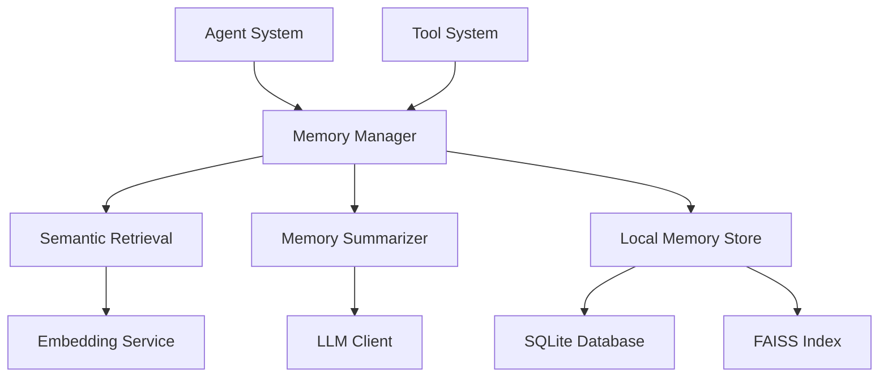

# Memory System

This document provides comprehensive documentation for the Personal Assistant's memory system, which enables persistent context, semantic search, and intelligent information retrieval across conversations.

## Overview

The memory system consists of multiple integrated components that work together to provide:

- **Episodic Memory**: Records of user interactions and agent actions
- **Semantic Memory**: Vector-based storage for meaning-based retrieval
- **Working Memory**: Current conversation context and state
- **Declarative Memory**: Factual knowledge and learned information

## Architecture



## Core Components

### Memory Manager (`memory_manager.py`)

Central orchestrator for all memory operations:

```python
class MemoryManager:
    async def store_episodic_memory(self, user_message: str, assistant_reply: str) -> None:
        """Store a user-agent interaction as episodic memory."""

    async def retrieve_memories(self, query: str, limit: int = 5) -> Dict[str, List[str]]:
        """Retrieve relevant semantic and episodic memories."""

    async def summarize_and_store_semantic_memory(self) -> int:
        """Summarize recent episodic memories into semantic memory."""
```

### Local Memory Store (`storage/local_store.py`)

SQLite + FAISS implementation for local memory storage:

```python
class LocalMemoryStore:
    async def add(self, text: str, user_id: str, metadata: Dict[str, Any]) -> str:
        """Add text to memory with metadata."""

    async def search(self, query: str, user_id: str, limit: int = 5) -> List[Dict[str, Any]]:
        """Search memories by semantic similarity."""

    async def get_all(self, user_id: str, limit: Optional[int] = None) -> List[Dict[str, Any]]:
        """Get all memories for a user."""
```

### Semantic Retrieval (`retrieval/retrieval.py`)

Intelligent retrieval strategies combining semantic and keyword-based search:

```python
class SemanticRetrieval:
    async def hybrid_search(self, query: str, user_id: str, limit: int = 5) -> Dict[str, List[Dict[str, Any]]]:
        """Combined semantic and episodic memory search."""
```

### Memory Summarizer (`retrieval/summarizer.py`)

Automatic summarization of episodic memories into semantic knowledge:

```python
class MemorySummarizer:
    async def summarize_episodic_memories(self, user_id: str, session_id: str) -> int:
        """Summarize recent episodic memories into semantic memory."""
```

## Data Models

### Episodic Memory Schema

```python
@dataclass
class EpisodicMemory:
    user_id: str
    session_id: str
    content: str
    timestamp: datetime
    metadata: Dict[str, Any] = field(default_factory=dict)
```

### Memory Item Schema

```python
@dataclass
class MemoryItem:
    id: str
    content: str
    metadata: Dict[str, Any]
    embedding: List[float]
    similarity_score: float
    timestamp: float
```

## Usage Examples

### Basic Memory Operations

```python
from backend.src.memory import MemoryManager

# Initialize memory system
memory = MemoryManager(
    user_id="user123",
    session_id="session456",
    memory_store=LocalMemoryStore(embedder),
    retrieval=SemanticRetrieval(memory_store, embedder),
    summarizer=MemorySummarizer(llm_client, memory_store),
    cfg=app_config
)

# Store an interaction
await memory.store_episodic_memory(
    user_message="What's the weather?",
    assistant_reply="I'll check the weather for you."
)

# Retrieve relevant memories
memories = await memory.retrieve_memories(
    query="weather information",
    limit=5
)

# Format for LLM context
context = memory.format_context(memories)
```

### Memory Integration in Agents

The memory system integrates automatically with the agent system:

```python
# Agent session automatically retrieves relevant memories
async for message in agent_session.process_query("Tell me about our previous discussion"):
    # Agent will have access to relevant past conversations
    print(message)
```

## Configuration

Memory system configuration is managed through the main application config:

```yaml
memory:
  enabled: true
  storage_type: "local"  # Currently only local storage supported
  max_history_length: 1000
  embedding_model: "all-MiniLM-L6-v2"
  similarity_threshold: 0.7
  cleanup_interval_hours: 24
  max_memory_items: 50000

embeddings:
  model_name: "sentence-transformers/all-MiniLM-L6-v2"
  device: "cuda"  # or "cpu"
  cache_size: 1000
  batch_size: 32
```

## Performance Optimization

### Caching Strategies
- **Embedding Cache**: Avoid re-computing embeddings for identical text
- **Query Cache**: Cache frequent retrieval queries
- **Result Cache**: Cache search results with TTL

### Storage Optimization
- **Index Optimization**: Regular FAISS index rebuilding
- **Compression**: Vector quantization for reduced storage
- **Partitioning**: User-scoped partitioning for data isolation

### Retrieval Optimization
- **Approximate Search**: FAISS IVF indices for faster search
- **Pre-filtering**: Metadata-based filtering before vector search
- **Batch Processing**: Process multiple queries simultaneously

## Privacy & Security

### Data Protection
- **Encryption**: Sensitive metadata is encrypted at rest
- **Access Control**: Memory access restricted by user permissions
- **Data Isolation**: User memories are completely isolated

### Privacy Features
- **Opt-in Storage**: Users can disable memory storage via config
- **Data Export**: Memories can be exported for user access
- **Data Deletion**: Complete memory wipe functionality
- **Audit Logging**: Memory access is logged for transparency

## Monitoring & Maintenance

### Health Checks
```python
# Check memory system health
stats = await memory_store.get_stats(user_id)
# Returns: item count, storage size, last updated, etc.
```

### Maintenance Operations
```python
# Cleanup old memories
await memory_store.delete_old_memories(user_id, older_than_days=30)

# Rebuild search indices
await memory_store.rebuild_indices(user_id)

# Optimize storage
await memory_store.optimize_storage(user_id)
```

## Integration Points

### Agent System Integration
The memory system integrates deeply with the agent orchestrator:
- **Context Retrieval**: Agents automatically retrieve relevant memories
- **Learning**: Agents store successful patterns for future use
- **Personalization**: User preferences and behavior patterns

### Tool System Integration
Tools can leverage memory for enhanced functionality:
- **Context Awareness**: Tools access conversation history
- **Learning**: Tools improve based on past performance
- **Caching**: Tool results cached in memory for faster access

## API Reference

### MemoryManager Methods

| Method | Description | Parameters | Returns |
|--------|-------------|------------|---------|
| `store_episodic_memory()` | Store user-agent interaction | `user_message: str, assistant_reply: str` | `None` |
| `retrieve_memories()` | Get relevant memories | `query: str, limit: int` | `Dict[str, List[str]]` |
| `summarize_and_store_semantic_memory()` | Create semantic memories | - | `int` (count created) |
| `format_context()` | Format memories for LLM | `memories: Dict[str, List[str]]` | `str` |

### Configuration Options

| Option | Type | Default | Description |
|--------|------|---------|-------------|
| `memory.enabled` | bool | `true` | Enable/disable memory system |
| `memory.max_history_length` | int | `1000` | Maximum conversation history length |
| `memory.similarity_threshold` | float | `0.7` | Minimum similarity score for retrieval |
| `memory.cleanup_interval_hours` | int | `24` | Automatic cleanup interval |
| `embeddings.model_name` | str | `"all-MiniLM-L6-v2"` | Sentence transformer model |
| `embeddings.device` | str | `"cuda"` | Device for embeddings (cuda/cpu) |

## Troubleshooting

### Common Issues

#### High Memory Usage
```python
# Check memory usage
stats = await memory_store.get_stats(user_id)
print(f"Total items: {stats['total_items']}")
print(f"Storage size: {stats['storage_size_mb']}MB")

# Cleanup old entries
await memory_store.delete_old_memories(user_id, older_than_days=90)
```

#### Slow Retrieval
```python
# Check if indices need rebuilding
# Rebuild indices periodically for optimal performance
await memory_store.rebuild_indices(user_id)
```

#### Embedding Errors
```python
# Verify embedding model configuration
# Check that the model is properly loaded and device is available
try:
    test_embedding = await embedder.encode_text("test")
    print("Embeddings working correctly")
except Exception as e:
    print(f"Embedding error: {e}")
```

## Future Enhancements

### Planned Features
- **Multi-modal Memory**: Support for images, audio, and video
- **Graph-based Memory**: Relationship-aware memory storage
- **Federated Learning**: Cross-device memory synchronization
- **Advanced Reasoning**: Memory-based causal reasoning

This memory system provides the foundation for persistent, intelligent context management in the Personal Assistant, enabling truly personalized and continuity-aware interactions.
