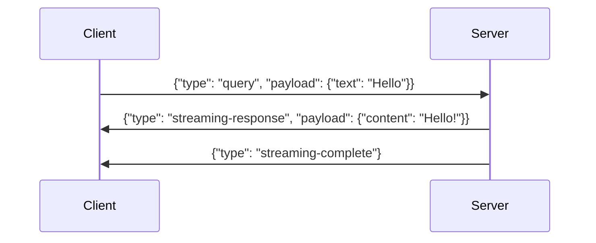
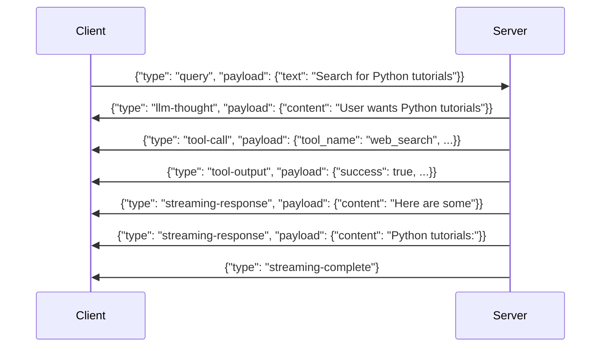
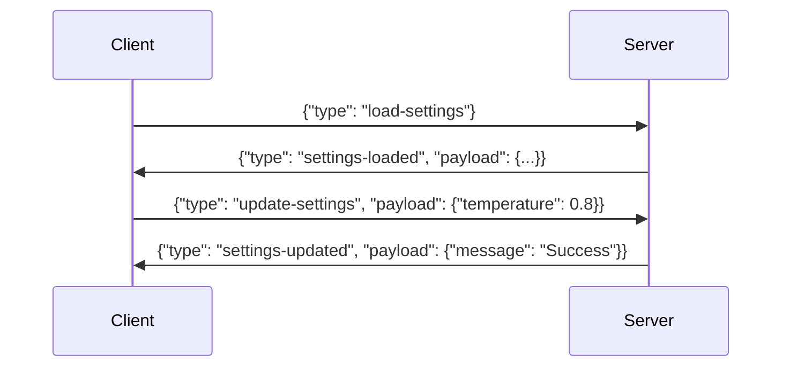

# API Reference

This document provides comprehensive documentation for the Personal Assistant Backend API, including WebSocket endpoints, message types, and response formats.

## WebSocket API

The Personal Assistant uses WebSocket connections for real-time communication between the frontend and backend.

### Connection Details

- **URL**: `ws://localhost:8765/ws`
- **Protocol**: WebSocket
- **Authentication**: Handshake-based with user identification
- **CORS**: Configured for `http://localhost:5173` (development frontend)

### Connection Handshake

All WebSocket connections must start with a handshake message:

```json
{
  "type": "handshake",
  "user_id": "user123"
}
```

**Response**: Connection accepted or closed with code 1008 (handshake failed)

### Message Format

All messages follow this structure:

```json
{
  "id": "unique-message-id",
  "type": "message-type",
  "payload": {
    // Message-specific data
  },
  "user_id": "user-identifier"
}
```

**Fields**:
- `id` (string): Unique message identifier for request-response correlation
- `type` (string): Message type identifier
- `payload` (object): Message-specific data payload
- `user_id` (string, optional): User identifier (injected by server)

## Message Types

### Incoming Messages

#### Ping Message
Health check message to verify WebSocket connection.

```json
{
  "id": "ping-123",
  "type": "ping",
  "payload": {
    "text": "optional-custom-message"
  }
}
```

**Response**:
```json
{
  "type": "pong",
  "id": "ping-123",
  "payload": {
    "text": "Pong" // or custom message if provided
  }
}
```

#### Query Message
Send a user query to the assistant for processing.

```json
{
  "id": "query-456",
  "type": "query",
  "payload": {
    "text": "What is the weather today?"
  }
}
```

**Streaming Responses**:
The query triggers a series of streaming responses:

1. **LLM Thought** (optional):
```json
{
  "type": "llm-thought",
  "id": "query-456",
  "payload": {
    "content": "The user is asking about weather..."
  }
}
```

2. **Tool Call** (if tools are needed):
```json
{
  "type": "tool-call",
  "id": "query-456",
  "payload": {
    "tool_name": "web_search",
    "parameters": {"query": "current weather"},
    "raw_call": "web_search(query=\"current weather\")"
  }
}
```

3. **Tool Output** (after tool execution):
```json
{
  "type": "tool-output",
  "id": "query-456",
  "payload": {
    "tool_name": "web_search",
    "success": true,
    "execution_time": 1.23,
    "output": "Weather data retrieved...",
    "error": null,
    "screenshot": "base64-encoded-image" // optional
  }
}
```

4. **Streaming Response** (final answer chunks):
```json
{
  "type": "streaming-response",
  "id": "query-456",
  "payload": {
    "content": "The weather today is sunny with a high of 75°F."
  }
}
```

5. **Streaming Complete**:
```json
{
  "type": "streaming-complete",
  "id": "query-456",
  "payload": {}
}
```

**Audio Responses** (if TTS enabled):
```json
{
  "type": "audio-chunk",
  "id": "query-456",
  "payload": {
    "audio": "base64-encoded-pcm-data",
    "sample_rate": 22050
  }
}
```

#### Load Settings Message
Request the current application settings.

```json
{
  "id": "settings-789",
  "type": "load-settings"
}
```

**Response**:
```json
{
  "type": "settings-loaded",
  "id": "settings-789",
  "payload": {
    "selected_model_id": "gpt-4",
    "max_history_length": 50,
    "temperature": 0.7,
    "memory_enabled": true,
    // ... other config fields (excluding sensitive data like API keys)
  }
}
```

#### Update Settings Message
Update application settings.

```json
{
  "id": "update-101",
  "type": "update-settings",
  "payload": {
    "selected_model_id": "claude-3-sonnet",
    "temperature": 0.8,
    "max_history_length": 100
  }
}
```

**Response**:
```json
{
  "type": "settings-updated",
  "id": "update-101",
  "payload": {
    "message": "Settings updated successfully"
  }
}
```

#### List Models Message
Request available LLM models.

```json
{
  "id": "models-202",
  "type": "list-models"
}
```

**Response**:
```json
{
  "type": "models-listed",
  "id": "models-202",
  "payload": {
    "openai": [
      {"id": "gpt-4", "name": "GPT-4", "context_window": 8192},
      {"id": "gpt-3.5-turbo", "name": "GPT-3.5 Turbo", "context_window": 4096}
    ],
    "anthropic": [
      {"id": "claude-3-opus", "name": "Claude 3 Opus", "context_window": 200000},
      {"id": "claude-3-sonnet", "name": "Claude 3 Sonnet", "context_window": 200000}
    ]
  }
}
```

### Error Responses

All message types can return error responses:

```json
{
  "type": "error",
  "id": "original-message-id",
  "payload": {
    "message": "Human-readable error message",
    "content": "Optional additional error details"
  }
}
```

## Message Flow Examples

### Simple Query Flow



### Complex Query with Tools



### Settings Update Flow



## Configuration Schema

The settings payload uses the following structure (based on `AppConfig`):

```typescript
interface AppConfig {
  // LLM Configuration
  selected_provider?: string;
  selected_model_id?: string;
  temperature?: number;
  max_tokens?: number;

  // Memory Configuration
  memory_enabled?: boolean;
  max_history_length?: number;
  memory_storage_type?: string;

  // Tool Configuration
  tool_timeout_seconds?: number;
  max_tool_execution_time?: number;
  tool_categorization_enabled?: boolean;

  // Security Configuration
  allow_file_operations?: boolean;
  allow_network_requests?: boolean;
  max_file_size_mb?: number;

  // TTS Configuration
  tts_enabled?: boolean;
  tts_provider?: string;
  tts_voice?: string;

  // Logging Configuration
  log_level?: string;
  enable_request_logging?: boolean;
}
```

## Error Codes

### Validation Errors
- `Invalid query: [details]` - Query validation failed
- `Invalid update-settings message: [details]` - Settings validation failed
- `Invalid load-settings message: [details]` - Load settings validation failed

### Runtime Errors
- `No model selected. Please select a model in settings.` - No LLM configured
- `Internal error: [details]` - Unexpected server error
- `Failed to load settings: [details]` - Configuration loading error

### Tool Execution Errors
- Tool-specific error messages in `tool-output` payloads
- Timeout errors for long-running operations
- Permission denied errors for restricted operations

## Rate Limiting

- No explicit rate limiting implemented at the API level
- LLM provider rate limits apply based on your API keys
- Tool execution may have timeouts configured per tool

## Connection Management

### Session Lifecycle
- Sessions are created on first query per user
- Sessions persist across WebSocket reconnections
- Sessions are cleaned up on WebSocket disconnect
- Session state includes conversation history and context

### Concurrent Connections
- Multiple WebSocket connections per user supported
- Each connection maintains separate session state
- User identification through handshake `user_id`

## Development and Testing

### Testing Messages
Send ping messages to verify connection:

```javascript
const ws = new WebSocket('ws://localhost:8765/ws');

// Handshake
ws.onopen = () => {
  ws.send(JSON.stringify({
    type: 'handshake',
    user_id: 'test-user'
  }));

  // Test ping
  ws.send(JSON.stringify({
    id: 'test-ping',
    type: 'ping',
    payload: { text: 'Test' }
  }));
};

ws.onmessage = (event) => {
  const message = JSON.parse(event.data);
  console.log('Received:', message);
};
```

### Error Handling
Always handle error message types:

```javascript
ws.onmessage = (event) => {
  const message = JSON.parse(event.data);

  if (message.type === 'error') {
    console.error('API Error:', message.payload.message);
    // Handle error appropriately
  } else {
    // Handle success responses
  }
};
```

## Future Extensions

The message handler registry pattern allows for easy addition of new message types:

1. Create a new message handler class inheriting from `MessageHandler`
2. Define message validation and handling logic
3. Register the handler in the handler registry
4. Add corresponding Pydantic schemas to `api/schema.py`

This extensible architecture supports adding new features without breaking existing clients.
