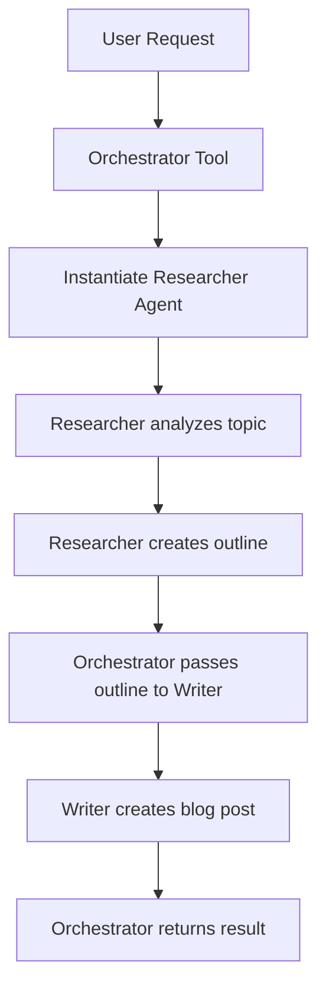

# Blog Writer Agent

A sophisticated tool for creating complete blog posts using specialized AI agents. This tool demonstrates advanced agent orchestration patterns in the Personal Assistant system.

## Overview

The Blog Writer Agent uses a multi-agent architecture to create professional blog content:

1. **Researcher Agent**: Analyzes the topic and creates a structured outline
2. **Writer Agent**: Converts the outline into polished blog content
3. **Orchestrator Tool**: Coordinates the entire process and manages agent interactions

## Architecture

### Agent-Based Design

This tool showcases the agent orchestration capabilities of the Personal Assistant SDK:

- **Specialized Agents**: Each agent has a specific role and expertise
- **System Prompts**: Carefully crafted prompts define agent behavior
- **Tool Access**: Agents can use system tools for research and data gathering
- **Orchestration**: The main tool coordinates agent execution and result synthesis

### Agent Roles

#### Researcher Agent
- **Purpose**: Topic analysis and content structuring
- **Capabilities**: Research trends, identify audience, create outlines
- **Tools**: File reading, shell commands for web research
- **Output**: Structured H1/H2/H3 outline

#### Writer Agent
- **Purpose**: Content creation and polishing
- **Capabilities**: Professional writing, tone adaptation
- **Tools**: None (pure writing agent)
- **Output**: Complete blog post

#### Orchestrator Tool
- **Purpose**: Process coordination and result delivery
- **Capabilities**: Agent instantiation, workflow management
- **Input**: Topic string
- **Output**: Complete blog post with research and writing

## Usage

### Basic Usage

```python
from backend.src.sdk.tool import Tool
from backend.src.sdk.context import Context

# The tool is automatically registered by the system
# Usage through LLM: "Write a blog post about Python async programming"

# Direct instantiation:
tool = BlogOrchestrator()
result = await tool.run(
    args=TopicArgs(topic="Python Async Programming"),
    ctx=context
)
```

### Input Parameters

```python
class TopicArgs(BaseModel):
    topic: str = Field(..., description="The topic to research and write about")
```

### Output Format

```python
{
    "success": True,
    "data": {
        "outline": "# H1 Title\n## H2 Section\n### H3 Subsection",
        "article": "Complete blog post content...",
        "research_summary": "Key findings from research phase"
    },
    "llm_content": "Complete blog post content...",
    "return_display": "Complete blog post content..."
}
```

## Configuration

### Manifest Configuration

```json
{
    "name": "write_blog_post",
    "version": "1.0.0",
    "description": "Creates a full blog post by researching and then writing it using specialized sub-agents.",
    "author": "Team",
    "category": "productivity",
    "tool_class_name": "BlogOrchestrator",
    "permissions": ["file_read", "network_access", "browser_usage"],
    "is_destructive": false
}
```

### System Prompts

#### Researcher Prompt
```
You are an expert Researcher.
Identify target audience, research trends, and produce a structured outline (H1/H2/H3).
Return ONLY the outline.
```

#### Writer Prompt
```
You are an expert Writer.
Convert the provided outline into a polished blog post.
Ensure tone is professional.
```

## Agent Workflow



## Features

### Research Capabilities
- **Trend Analysis**: Identifies current trends and audience interests
- **Content Gaps**: Finds underserved topics and angles
- **Structure Optimization**: Creates SEO-friendly heading hierarchies
- **Source Integration**: Incorporates research from available tools

### Writing Capabilities
- **Professional Tone**: Adapts to appropriate professional standards
- **Structure Adherence**: Follows outline structure precisely
- **Engagement Optimization**: Creates compelling, readable content
- **Length Management**: Produces appropriately sized articles

### Orchestration Features
- **Error Handling**: Graceful failure recovery between agents
- **Result Synthesis**: Combines research and writing outputs
- **Quality Assurance**: Validates output completeness
- **Performance Monitoring**: Tracks agent execution times

## Security Considerations

### Permissions Required
- `file_read`: For accessing research materials
- `network_access`: For web research capabilities
- `browser_usage`: For advanced web scraping if needed

### Sandboxing
- Agents run in isolated execution contexts
- Tool access is controlled and audited
- Network requests are monitored and limited

## Performance Characteristics

### Execution Time
- **Typical**: 30-90 seconds for complete blog post
- **Factors**: Topic complexity, research depth, content length

### Resource Usage
- **Memory**: Moderate (agent instantiation and context)
- **Network**: Variable (depends on research requirements)
- **CPU**: High during LLM processing phases

## Error Handling

### Common Error Scenarios
- **Research Failure**: Fallback to basic outline generation
- **Writing Failure**: Retry with simplified instructions
- **Tool Access Denied**: Graceful degradation of functionality

### Recovery Mechanisms
- **Agent Restart**: Failed agents can be reinstantiated
- **Partial Results**: Return available outputs even on partial failure
- **User Notification**: Clear error messages and recovery suggestions

## Extension Points

### Custom Agents
- Add specialized research agents for specific domains
- Create writing agents with different styles or tones
- Implement fact-checking or editing agents

### Enhanced Tools
- Integrate additional research tools (APIs, databases)
- Add multimedia content generation
- Implement publishing workflows

## Best Practices

### Topic Selection
- Choose specific, researchable topics
- Consider audience expertise level
- Ensure sufficient background information available

### Quality Assurance
- Review agent outputs for accuracy
- Verify outline completeness before writing
- Check final content for coherence and flow

### Performance Optimization
- Cache research results for similar topics
- Use agent specialization for common patterns
- Monitor execution times and optimize prompts

## Examples

### Technology Blog Post
```python
args = TopicArgs(topic="The Future of Quantum Computing")
result = await blog_writer.run(args, context)
# Returns comprehensive analysis with technical depth
```

### Business Article
```python
args = TopicArgs(topic="Remote Work Productivity Strategies")
result = await blog_writer.run(args, context)
# Returns practical, actionable business content
```

### Tutorial Content
```python
args = TopicArgs(topic="Building REST APIs with FastAPI")
result = await blog_writer.run(args, context)
# Returns step-by-step tutorial with code examples
```

## Troubleshooting

### Research Agent Issues
- **Symptom**: Outline is too brief or generic
- **Solution**: Provide more specific topic constraints
- **Prevention**: Use detailed topic descriptions

### Writing Agent Issues
- **Symptom**: Content doesn't match outline structure
- **Solution**: Simplify outline or provide clearer instructions
- **Prevention**: Ensure outline clarity before writing phase

### Performance Issues
- **Symptom**: Long execution times
- **Solution**: Break complex topics into smaller articles
- **Prevention**: Monitor agent performance and optimize prompts

## Future Enhancements

### Planned Features
- **Multi-language Support**: Generate content in multiple languages
- **SEO Optimization**: Automatic keyword and meta description generation
- **Image Integration**: AI-generated or stock image suggestions
- **Social Media**: Auto-generate social posts from blog content

### Research Directions
- **Agent Collaboration**: Multiple researchers working together
- **Content Personalization**: Adapt content for specific audiences
- **Quality Metrics**: Automated content quality scoring
