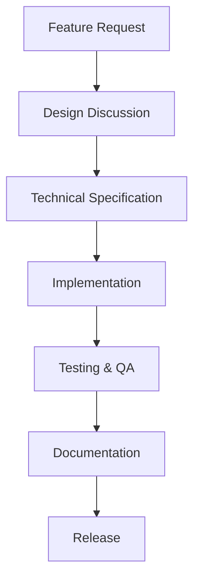

# Project Roadmap

This document outlines the development roadmap for the Personal Assistant project, detailing completed milestones, current work, and planned future enhancements.

## Project Vision

**Desktop Assistant** is an AI-powered personal assistant that fundamentally changes how people interact with their computers. Instead of needing to know commands, navigate complex UIs, or repeatedly explain context to disconnected AI services, users will have a persistent, context-aware agent that:

- **Remembers everything** you've done and are working on
- **Controls your computer** through voice or text commands
- **Adapts to your workflow** by learning from your patterns
- **Executes complex tasks** automatically using an intelligent tool marketplace

---

## ✅ Completed Milestones

### Milestone 1: Project Foundation
**Status**: ✅ Complete | **Date**: Q4 2024

- [x] Project setup & repository structure
- [x] Backend-frontend IPC communication via WebSocket
- [x] Basic UI shell with Electron + React
- [x] Configuration management system
- [x] Dependency injection container setup
- [x] Core infrastructure (logging, error handling)

### Milestone 2: Core Agent Intelligence
**Status**: ✅ Complete | **Date**: Q4 2024

- [x] Multi-provider LLM integration (OpenAI, Anthropic, Google, Gemini, Ollama, OpenRouter, Mistral, LM Studio)
- [x] Advanced agent orchestrator with tool calling capabilities
- [x] Real-time thinking display and status updates
- [x] Conversation history and context management
- [x] WebSocket streaming API for real-time responses
- [x] Protocol-based interfaces for clean architecture

### Milestone 3: Memory & Learning
**Status**: ✅ Complete | **Date**: Q4 2024

- [x] Semantic memory system with FAISS vector search
- [x] Episodic memory for user actions tracking
- [x] CUDA-accelerated embeddings for performance
- [x] Privacy controls and local data storage
- [x] Memory vector storage with async operations
- [x] Context-aware conversation persistence

### Milestone 4: Advanced Automation
**Status**: ✅ Complete | **Date**: Q4 2024

- [x] Complete Tool Marketplace System with security validation
- [x] Advanced Computer Control Tools:
  - OCR-enhanced UI automation (`click_ocr_element`)
  - Vision-language models (`predict_click` with InternVL)
  - Comprehensive file system operations
  - Terminal command execution with safety controls
- [x] CoAct-1 Multi-Agent System (Orchestrator, Programmer, GUI Operator)
- [x] Intelligent task execution with natural language processing
- [x] Automatic screenshot capture for visual feedback

### Milestone 5: Performance & Polish
**Status**: ✅ Complete | **Date**: Q4 2024

- [x] CUDA acceleration for embeddings and OCR processing
- [x] Automatic screenshots after computer interactions
- [x] Complete file system integration toolkit
- [x] Marketplace tools (CoAct-1 automation, example tools, weather)
- [x] Performance monitoring and optimization
- [x] Security framework with permission system
- [x] Plugin system architecture for extensibility

### Milestone 6: Documentation & Testing
**Status**: ✅ Complete | **Date**: Q4 2024

- [x] Comprehensive testing framework (unit, integration, e2e)
- [x] Complete documentation structure
- [x] CI/CD pipeline with automated quality checks
- [x] Architecture Decision Records (ADR) system
- [x] API documentation and reference guides
- [x] Extension points catalog
- [x] Performance and security guidelines

---

## 🔄 Current Development Focus

### Milestone 7: Voice Integration
**Status**: 🔄 In Progress | **Target**: Q4 2025

Voice integration represents a major UX improvement, enabling hands-free operation and more natural interaction patterns.

#### Core Features
- [ ] **Speech-to-Text (STT) Integration**
  - Multi-provider STT support (Whisper, Google Speech, Azure Cognitive Services)
  - Real-time audio processing pipeline
  - Wake word detection with snowboy/porcupine
  - Audio normalization and noise reduction

- [ ] **Text-to-Speech (TTS) Integration**
  - Multi-provider TTS support (ElevenLabs, Azure, Google TTS)
  - Voice selection and customization
  - Streaming audio output
  - Interrupt handling for new responses

- [ ] **Audio Processing Pipeline**
  - Audio capture and buffering
  - Voice activity detection (VAD)
  - Audio format conversion and optimization
  - Low-latency processing for real-time interaction

#### Advanced Features
- [ ] **Voice Commands & Shortcuts**
  - Custom voice command definitions
  - Voice-based tool activation
  - Context-aware voice responses

- [ ] **Audio Context Awareness**
  - Background noise filtering
  - Speaker identification
  - Meeting/conversation detection

---

## 📋 Planned Future Milestones

### Milestone 8: Advanced AI Features
**Status**: 📋 Planned | **Target**: Q2 2025

#### Multi-Modal Intelligence
- [ ] **Enhanced Vision Capabilities**
  - Real-time screen understanding
  - Advanced OCR with layout analysis
  - Visual change detection
  - Screenshot analysis and summarization

- [ ] **Cross-Application Workflows**
  - Application state monitoring
  - Inter-application data transfer
  - Workflow automation across multiple apps
  - Context preservation across application switches

#### Advanced Memory Features
- [ ] **Long-term Memory Management**
  - Memory consolidation and summarization
  - Importance scoring and retention policies
  - Memory visualization and search
  - Export/import memory capabilities

- [ ] **Learning and Adaptation**
  - User behavior pattern recognition
  - Personalized automation suggestions
  - Workflow optimization recommendations
  - Adaptive UI based on usage patterns

### Milestone 9: Enterprise Features
**Status**: 📋 Planned | **Target**: Q3 2025

#### Security & Compliance
- [ ] **Enterprise Security**
  - End-to-end encryption for all communications
  - Audit logging and compliance reporting
  - Role-based access control (RBAC)
  - Data residency controls

- [ ] **Privacy & Governance**
  - Privacy-preserving memory storage
  - Data retention policies
  - User data export/deletion
  - Consent management system

#### Scalability & Performance
- [ ] **Distributed Architecture**
  - Multi-instance coordination
  - Load balancing and failover
  - Distributed memory synchronization
  - Horizontal scaling capabilities

- [ ] **Performance Optimization**
  - Advanced caching strategies
  - GPU resource management
  - Memory optimization and garbage collection
  - Database performance tuning

### Milestone 10: Ecosystem Expansion
**Status**: 📋 Planned | **Target**: Q4 2025

#### Tool Marketplace Evolution
- [ ] **Advanced Marketplace Features**
  - Tool ratings and reviews system
  - Premium tool marketplace
  - Tool dependency management
  - Automated tool updates

- [ ] **Community Features**
  - Public tool repository
  - Tool sharing and collaboration
  - Community governance model
  - Developer incentive programs

#### Integration Ecosystem
- [ ] **Third-Party Integrations**
  - Calendar and scheduling integration
  - Email and communication tools
  - Project management systems
  - Cloud storage services

- [ ] **API Ecosystem**
  - REST API for external integrations
  - Webhook support for events
  - Plugin API for third-party extensions
  - SDK for custom integrations

---

## 🏆 Success Metrics

### Technical Metrics
- **Performance**: Sub-100ms response times for local operations
- **Reliability**: 99.9% uptime with graceful error handling
- **Scalability**: Support for 100+ concurrent users
- **Security**: Zero data breaches or privacy incidents

### User Experience Metrics
- **Adoption**: 10,000+ active users within 12 months
- **Satisfaction**: 4.5+ star rating across major platforms
- **Retention**: 80% monthly active user retention
- **Productivity**: 50%+ time savings for common tasks

### Business Metrics
- **Market Share**: Leading position in AI desktop assistant market
- **Revenue**: Sustainable business model with multiple revenue streams
- **Community**: Thriving open-source community with 100+ contributors
- **Innovation**: Industry recognition for AI innovation

---

## 🤝 Contributing to the Roadmap

### How to Get Involved

1. **Check Current Priorities**: Review the current milestone for active development areas
2. **Propose New Features**: Open issues for feature requests with detailed use cases
3. **Contribute Code**: Start with `good-first-issue` labeled items
4. **Join Discussions**: Participate in roadmap planning and design decisions

### Development Workflow

### Priority Framework

- **P0 (Critical)**: Security issues, data loss prevention, system crashes
- **P1 (High)**: Core functionality bugs, performance issues, UX blockers
- **P2 (Medium)**: Feature enhancements, minor bugs, technical debt
- **P3 (Low)**: Nice-to-have features, optimizations, documentation

---

## 📞 Contact & Coordination

- **Issues**: [GitHub Issues](https://github.com/yourusername/desktop-assistant/issues)
- **Discussions**: [GitHub Discussions](https://github.com/yourusername/desktop-assistant/discussions)
- **Milestone Tracking**: [Project Milestones](https://github.com/yourusername/desktop-assistant/milestones)

---

*This roadmap is living document that evolves with user feedback, technical discoveries, and market changes. Last updated: November 2025*
