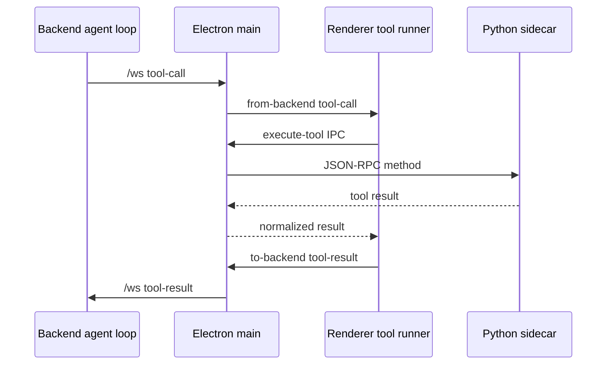

# Sidecar and Tool Channels

Local tools cross every WindieOS runtime boundary. The backend decides what the model can ask for, but the frontend and sidecar execute local machine actions.

## End-to-End Tool Channel

## Ownership Split

| Layer | Owns | Code roots |
| --- | --- | --- |
| Backend | model-facing tool schema, policy filtering, parser validation, tool-call events, result waiting, history commit | `backend/src/tools`, `backend/src/agent/tools`, `backend/src/api/processing/formatters/actions`, `backend/src/api/handlers/tool_results.py` |
| Renderer | tool-call display, stale-turn guards, surface preparation, local execution request, result persistence | `frontend/src/renderer/features/chat/hooks/useToolRunner.ts`, `frontend/src/renderer/infrastructure/services/ToolExecution*.ts` |
| Electron main | IPC channel ownership, sidecar process bridge, screenshot artifact upload, system-state bridge | `frontend/src/main/local_backend_bridge.cjs`, `frontend/src/main/ipc.cjs`, `frontend/src/main/python_bridge`-adjacent handlers |
| Python sidecar | executable tool implementations and JSON-RPC method registry | `frontend/src/main/python/local_backend.py`, `frontend/src/main/python/tools/**`, `frontend/src/main/python/memory/**` |

## Main IPC Channels

Sidecar-facing IPC channels are documented in [IPC Channel and Handler Reference](../frontend/contracts/ipc_channel_and_handler_reference.md).

Common local channels:

- `execute-tool`: run a sidecar executable tool
- `get-system-state`: collect local OS/window/runtime state
- `search-memory`: query local memory
- `search-conversations`: query transcript conversation index
- `store-memory`, `store-transcript`, and list/delete memory channels

Renderer code should call the typed IPC bridge instead of raw Electron APIs.

## Sidecar JSON-RPC Boundary

The sidecar uses line-oriented JSON-RPC over stdin/stdout through Electron main. This boundary is intentionally separate from backend HTTP/WebSocket contracts.

Sidecar method families:

- computer tools: mouse, keyboard, screenshot, scroll, window operations
- browser tools: dedicated browser launch/control/snapshot/file helpers
- filesystem tools: read/replace/path handling
- shell/process tools: command execution and process sessions
- system tools: waits, windows, system stats
- memory tools: local transcript/episodic/semantic storage and search
- wakeword service: separate subprocess protocol, not the generic JSON-RPC tool channel

Read next:

- [Frontend Sidecar Docs Hub](../frontend/sidecar/README.md)
- [Frontend Sidecar Tools Docs Hub](../frontend/sidecar/tools/README.md)
- [Python Sidecar Runtime and Memory](../frontend/sidecar/python_sidecar_and_memory.md)
- [Sidecar JSON-RPC Protocol Reference](../frontend/sidecar/core/json_rpc_protocol_stdout_framing_and_shutdown_signal_runtime_reference.md)

## Tool Result Return Path

After sidecar execution, renderer/main must return results to the backend using the normal `/ws` tool-result path.

Result path rules:

- use `tool-result` for single calls.
- use `tool-bundle-result` for bundled/atomic tool execution.
- preserve request ids and tool-call ids expected by backend waiting/history code.
- preserve screenshot/artifact refs when tool output includes images.
- normalize local failures into model-visible tool outputs rather than silently dropping the call.

Read next:

- [Tool Execution Lifecycle](../tools/tool_execution_lifecycle.md)
- [Backend Tool Result Ingress Reference](../backend/tools/tool_result_ingress_and_storage_reference.md)
- [Frontend Tool Execution Service and Hook Runtime Reference](../frontend/renderer/infrastructure/tool_execution_service_and_hook_runtime_reference.md)

## Common Failure Routing

| Symptom | Owner to inspect |
| --- | --- |
| model never sees tool | backend tool schema/policy |
| backend emits tool-call but renderer never acts | main relay or renderer stream event consumer |
| renderer starts tool but sidecar never receives it | IPC/local backend bridge |
| sidecar returns error before action | sidecar tool validation/runtime |
| action succeeds but model does not continue | tool-result ingress, request id, or history commit path |
| screenshot path exists but image missing in chat | artifact upload/materialization path |

## Validation

Use the narrowest test set for the changed boundary:

- backend schema/policy/formatter/tool-result tests for model-facing changes
- renderer tool-runner tests for local dispatch/result projection changes
- main-process IPC/local-backend bridge tests for channel mapping changes
- sidecar pytest tests for executable tool behavior
- parity tests when backend schema and sidecar executable payloads must stay aligned

Run `./bin/docs-list` after docs updates.
