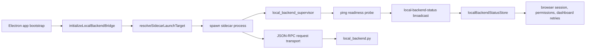

# Local-Backend Process Lifecycle Change Workflow

Use this workflow when the Python sidecar process itself is starting, stopping, reporting readiness, or failing to answer requests. Use [Local Backend JSON-RPC Change Workflow](../../sidecar/local_backend_jsonrpc_change_workflow.md) for method registration and payload-shape changes after the process is already reachable.

## Runtime Path

Electron main owns the sidecar process lifetime. Renderer code consumes readiness and error status, but it must not spawn, restart, or inspect the Python process directly.

## Source of Truth

| Surface | Code | Role |
| --- | --- | --- |
| Bridge composition | `frontend/src/main/local_backend_bridge.cjs` | Wires focused lifecycle modules, readiness runtime, transports, status broadcasts, and IPC handlers. |
| Supervisor state | `frontend/src/main/local_backend_supervisor.cjs` | Tracks active process, status, ready flag, generation, and last error. |
| Launch planning | `frontend/src/main/local_backend_launch_plan.cjs` | Resolves sidecar command/args/cwd/env and fail-fast packaged/source startup errors before spawning. |
| Process events | `frontend/src/main/local_backend_process_events.cjs` | Owns active-process exit/error reset policy and user-facing unavailable status messages. |
| Stop controller | `frontend/src/main/local_backend_stop_controller.cjs` | Owns daemon shutdown, stopped tool execution, standalone `SIGTERM`, and stale-guarded `SIGKILL`. |
| Stderr transport | `frontend/src/main/local_backend_stderr_transport.cjs` | Owns severity-filtered Python stderr forwarding and stale-process suppression. |
| Request transport | `frontend/src/main/local_backend_bridge_request_transport.cjs` | Owns JSON-RPC request ids, pending promise map, timeout rejection, and response dispatch. |
| Timeout policy | `frontend/src/main/local_backend_bridge_timeout_policy.cjs` | Defines default and browser-specific request timeout tiers. |
| Launch target resolution | `frontend/src/main/runtime_paths.cjs` | Chooses packaged sidecar binary, packaged Python runtime, source `.py`, or configured Python executable. |
| Endpoint/env inputs | `frontend/src/main/backend_endpoints.cjs`, `frontend/src/main/local_backend_bridge_utils.cjs` | Resolves backend URL/env and normalizes `NODE_OPTIONS`. |
| Renderer readiness store | `frontend/src/renderer/infrastructure/runtime/localBackendStatusStore.js` | Bootstraps current status and subscribes to `local-backend-status` events. |
| Browser readiness consumer | `frontend/src/renderer/infrastructure/runtime/browserSessionStore.js` | Gates browser session sync and controls on local-backend readiness. |
| Sidecar service | `frontend/src/main/python/local_backend.py`, `frontend/src/main/python/core/ipc_protocol.py` | Handles `ping`, JSON-RPC methods, stdout framing, shutdown, and sidecar initialization. |

## Change Decision Tree

| Symptom or request | Primary owner | Continue into |
| --- | --- | --- |
| Sidecar never starts, missing Python/runtime, wrong cwd/env, packaged-only launch failure | Electron main launch path | `local_backend_launch_plan.cjs`, `runtime_paths.cjs`, install/packaging docs |
| `local-backend-status` shows stale ready/error state | Supervisor and status broadcast path | `local_backend_supervisor.cjs`, `buildLocalBackendStatusPayload`, renderer status store |
| Readiness ping retries forever or old timers affect a new process | Readiness runtime plus supervisor generation path | `local_backend_readiness_runtime.cjs`, `local_backend_supervisor.cjs`, lifecycle tests |
| JSON-RPC call times out or rejects after process restart | Request transport and reset path | `local_backend_bridge_request_transport.cjs`, `resetBackendProcessState` |
| Browser controls wait forever despite sidecar readiness | Renderer readiness consumer | `localBackendStatusStore.js`, `browserSessionStore.js`, browser control tests |
| Python method exists but payload maps incorrectly | IPC/JSON-RPC contract, not lifecycle | [Local Backend JSON-RPC Change Workflow](../../sidecar/local_backend_jsonrpc_change_workflow.md) |
| Local tool result shape is wrong after sidecar executes | Tool execution contract, not lifecycle | [Sidecar Tool Change Workflow](../../sidecar_tool_change_workflow.md) |

## Lifecycle Contract

1. `initializeLocalBackendBridge(...)` resolves windows and calls `startLocalBackend(...)` before registering local-backend IPC handlers.
2. `startLocalBackend(...)` must no-op when an active process already exists.
3. Launch target resolution must prefer packaged binaries/runtime paths in packaged mode and source Python paths in development mode.
4. Startup env must preserve `PYTHONUNBUFFERED=1`, `WINDIE_BACKEND_HTTP_URL`, `WINDIE_BACKEND_AUTH_STATE_PATH` when provided, `WINDIE_PERMISSION_STATE_PATH` when provided, `WINDIE_PACKAGED_APP`, `WINDIE_ENABLE_BROWSER_FEATURE_PACK_AUTOINSTALL`, and packaged Python isolation variables when applicable.
5. `local_backend_supervisor.attachProcess(...)` must bump generation for every new process.
6. Readiness pings use `__readiness_check_<attempt>__` ids and stale callbacks/timers must abort when their captured token is no longer current.
7. A successful readiness response emits `local-backend-status` with `{ ready: true }`.
8. Exhausted readiness failures/timeouts mark the active process `error`, keep
   `ready:false`, and leave normal JSON-RPC requests blocked.
9. Non-zero exit and process errors reset state, reject pending requests, and emit unavailable status to renderer.
10. `stopLocalBackend()` sends `SIGTERM` and only force-kills the same still-active process after the timeout.

Do not remove the generation/token guard to make tests easier. That guard is what prevents stale process events, stale readiness timers, and delayed force-kill timers from corrupting a restarted sidecar.

## Status Payload Contract

| Field | Producer | Consumer contract |
| --- | --- | --- |
| `ready` | `buildLocalBackendStatusPayload()` and direct status sends | Renderer treats only `true` as ready; everything else gates local-backend-dependent controls. |
| `status` | `local_backend_supervisor` snapshot | Renderer defaults missing status to `ready` or `stopped` based on `ready`; keep values stable for debugging. |
| `error` | launch failure, process error, non-zero exit, supervisor last error | Renderer stores string errors and shows dependent feature failures without inspecting process internals. |

If a new lifecycle state is added, update the supervisor tests, renderer normalization, docs, and any UI that displays or gates on status. Avoid making renderer code infer detailed process state from log text.

## Request Correlation Rules

| Rule | Reason |
| --- | --- |
| Do not send normal JSON-RPC requests until `isBackendReady()` is true. | Prevents requests from racing Python imports and method registration. |
| Keep readiness IDs separate from normal UUID request ids. | Readiness responses route through `readinessCheckCallback`, not the pending request map. |
| Reject all pending requests on process reset. | Renderer callers need a terminal failure instead of hanging forever. |
| Treat unknown response IDs as warnings, not fatal process errors. | Late responses can arrive from stale or already-cleared pending requests. |
| Use timeout policy helpers instead of ad hoc per-call timers. | Keeps browser, tool, and memory behavior predictable across tests. |

## Packaged App Rules

Packaged sidecar behavior is different from source mode and must be validated separately when changed.

| Area | Required behavior |
| --- | --- |
| Missing bundled runtime | Emit reinstall guidance and do not spawn. |
| Python runtime env | Set Python isolation variables and delete `PYTHONPATH` when packaged Python runtime is used. |
| Browser feature pack autoinstall | Disabled in packaged mode, enabled in source mode unless explicitly overridden. |
| Sidecar binary path | Prefer packaged binary when present before falling back to Python runtime. |
| User-facing errors | Avoid machine-specific stack traces; use actionable runtime or reinstall guidance. |

If a source-mode change works but packaged mode fails, inspect `runtime_paths.cjs`, Electron Builder file inclusion, and the env passed into `spawn(...)` before changing Python sidecar code.

## Renderer Consumer Rules

Renderer readiness consumers should subscribe to `localBackendStatusStore` instead of invoking local-backend status repeatedly.
The store installs the live `local-backend-status` listener before starting the
bootstrap `get-local-backend-status` read. If a live event arrives while the
bootstrap read is pending, the bootstrap response is treated as stale and cannot
overwrite the newer event snapshot.

| Consumer | Expected behavior |
| --- | --- |
| Browser session store | Disconnects and clears busy state while local backend is not ready; syncs browser session after readiness becomes true. |
| Browser controls | Wait for readiness before issuing browser tool calls. |
| Dashboard conversation retry paths | Treat local-backend-not-ready as retryable where the existing dashboard utility does so. |
| Permission/browser probes | Use Electron main permission service and local-backend status helpers rather than direct process checks. |

When adding a new renderer feature that depends on the sidecar, wire it through the status store and test both initial bootstrap read and later `local-backend-status` event updates.

## Debug Routes

| Failure | First proof | Next file |
| --- | --- | --- |
| No sidecar spawn | Check launch target, missing command/script errors, and `spawn` call args. | `runtime_paths.cjs`, `local_backend_launch_plan.cjs`, `local_backend_bridge.cjs` |
| Spawn succeeds but never ready | Check ping ids, stdout JSON lines, stderr Python import failures, and fail-closed readiness status. | `local_backend_readiness_runtime.cjs`, `local_backend_stdout_transport.cjs`, `local_backend_stderr_transport.cjs`, `local_backend.py`, `core/ipc_protocol.py` |
| Ready event reaches main but renderer still disabled | Check `get-local-backend-status` bootstrap invoke and `local-backend-status` listener cleanup. | `localBackendStatusStore.js` |
| Browser controls stuck | Check browser session readiness handler and the first browser status/sync request after readiness. | `browserSessionStore.js` |
| In-flight calls hang after exit | Check pending request rejection on `resetBackendProcessState(...)`. | `local_backend_bridge_request_transport.cjs` |
| Packaged app only | Check packaged runtime path resolution, Python env isolation, and release packaging docs. | `runtime_paths.cjs`, `local_backend_launch_plan.cjs`, `docs/operations/release_packaging_change_workflow.md` |

## Test Matrix

| Changed behavior | Minimum focused tests |
| --- | --- |
| Supervisor generation/status semantics | `cd frontend && npm run test -- ../tests/frontend/LocalBackendSupervisor.test.cjs` |
| Startup, missing runtime, exit/error reset, readiness retry, force-kill races | `cd frontend && npm run test -- ../tests/frontend/LocalBackendBridge.lifecycle.test.cjs` |
| Request ids, large stdout lines, JSON-RPC errors, Node env options | `cd frontend && npm run test -- ../tests/frontend/LocalBackendBridge.rpc.test.cjs` |
| Renderer status subscription and browser readiness gating | `cd frontend && npm run test -- ../tests/frontend/ChatBrowserSessionControl.test.jsx` plus any direct status-store tests |
| Sidecar ping/protocol behavior | `./scripts/python-in-env sidecar pytest tests/sidecar/test_local_backend.py tests/sidecar/test_json_rpc_protocol.py` |
| Packaged path/runtime changes | focused runtime path tests plus package/reinstall smoke from [Release and Packaging Change Workflow](../../../operations/release_packaging_change_workflow.md) |

Docs-only changes should run `./bin/docs-list`, `git diff --check`, and a focused Markdown link check. Code changes should run the narrowest row above plus any adjacent IPC, sidecar, or packaging tests for the touched path.

## Related Docs

- [Frontend Main Local-Backend Docs Hub](README.md)
- [Local-Backend Process Lifecycle, Readiness, and Request-Correlation Reference](process_lifecycle_readiness_and_request_correlation_reference.md)
- [Local Backend Process Lifecycle Reference](../../sidecar/local_backend_process_lifecycle_reference.md)
- [Local Backend JSON-RPC Change Workflow](../../sidecar/local_backend_jsonrpc_change_workflow.md)
- [Sidecar Runtime Change Workflow](../../sidecar/sidecar_runtime_change_workflow.md)
- [IPC Change Workflow](../../ipc_change_workflow.md)
- [Release and Packaging Change Workflow](../../../operations/release_packaging_change_workflow.md)
