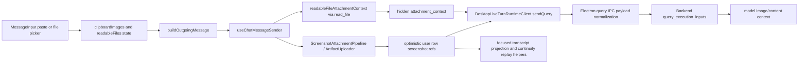

# Chat Attachment Change Workflow

Use this workflow for user-provided chat attachments: pasted images, selected image files, selected readable files, and optional query screenshots. It is narrower than [Artifact Change Workflow](../../../desktop/artifact_change_workflow.md), which also covers backend artifact storage, SDK access, and tool-result screenshots.

The core rule is: the composer owns selection and preview; the sender owns normalization, upload, and hidden context; backend query execution owns resolving refs into model input. Transcript/replay should preserve durable refs and visible filenames, not raw file contents.

## Runtime Path

## Fast Owner Map

| Symptom | First owner | Inspect first | Then inspect |
| --- | --- | --- | --- |
| Pasted image is not previewed | Composer paste parsing | `MessageInput.jsx`, `clipboardImageUtils.js`, `dataUrlImageUtils.js` | `tests/frontend/MessageInput.test.jsx`, `ClipboardImageUtils.test.js` |
| Selected image file is treated like readable text | File attachment bucketing | `fileAttachmentUtils.js`, `composerAttachmentPresentation.js`, `MessageInput.jsx` | `FileAttachmentUtils.test.js`, `MessageInput.test.jsx` |
| Readable file appears as a chip but model never sees content | Sender hidden context path | `readableFileAttachmentContext.ts`, `useChatMessageSender.ts` | sidecar `read_file` behavior and query payload tests |
| Attachment-only send is blocked | Composer outgoing payload builder | `message/messageInput.js`, `MessageInput.jsx` | `MessageInputUtils.test.js`, `MessageInput.test.jsx` |
| Send failure clears text or attachment previews | Composer draft lifecycle | `useChatComposerDraft.js`, `MessageInput.jsx` | `ChatComposerDraft.test.jsx`, `MessageInput.test.jsx` |
| Optimistic user row lacks filename chips | Sender payload normalization and chat store row | `chatMessageSenderPayloads.ts`, `chatMessageSenderUtils.ts`, `chatStore.ts` | `ChatMessageSenderPayloads.test.ts`, `ChatMessageSender.test.tsx` |
| Uploaded image has wrong content type or URL | Artifact upload pipeline | `ScreenshotAttachmentPipeline.ts`, `ArtifactUploader.ts`, `ArtifactImageUtils.ts` | `ScreenshotAttachmentPipeline.test.ts`, `ArtifactUploader.test.ts`, `ArtifactImageUtils.test.ts` |
| Query sends only one of multiple images | Sender screenshot ref selection | `queryScreenshotPipeline.ts`, `chatMessageSenderUtils.ts` | `ChatMessageSender.test.tsx`, backend query input tests |
| Electron query payload drops attachment fields | Main query IPC runtime and SDK enrichment | `frontend/src/main/ipc/ipc_query_runtime.cjs`, `packages/windie-sdk-js/src/runtime/ContextEnrichmentPipeline.ts` | `IpcQueryRuntime.test.cjs`, `WindieSdkContextEnrichment.test.ts` |
| Backend receives refs but model gets no image | Backend query input resolution | `backend/src/api/services/query_execution_support/query_execution_inputs.py` | `tests/backend/test_query_execution_inputs.py`, artifact route/store tests |
| Replayed message loses images | Message screenshot resolver and transcript replay | `messageScreenshots.js`, `useResolvedMessageScreenshots.js`, transcript replay state | `MessageScreenshots.test.js`, `MessageContent.test.jsx`, `RehydratePayload.test.js`, transcript tests |
| Artifact image fails once and never recovers | IPC-backed artifact screenshot cache | `useResolvedMessageScreenshots.js` | `MessageContent.test.jsx` retry-after-failure coverage |
| Copy image to clipboard fails | Electron clipboard image IPC | `frontend/src/main/ipc/ipc_clipboard_image.cjs` | `IpcClipboardImageHandler.test.cjs` |

Clipboard image IPC trust boundary:

- the renderer may request copy/context-menu actions, but main process only
  decodes bounded `data:image/*` payloads or fetches trusted backend artifact
  URLs under `/api/artifacts/...`
- main-process image fetches validate redirects, response size, and image
  content type before writing to the native clipboard

## Change Sequence

1. Classify the attachment source.
   - Pasted image: `clipboardImages[]`.
   - Selected image file: image bucket that becomes `clipboardImages[]`.
   - Selected readable file: `readableFiles[]`.
   - Query screenshot: sender-triggered screenshot capture, not a composer preview.

2. Preserve composer payload shape.
   - `buildOutgoingMessage(...)` may return a string for text-only sends.
   - It must return an object payload when images or readable files are attached.
   - Attachment-only sends should use the existing fallback text rather than blocking submission.
   - Clear the composer draft only after the send callback succeeds; rejected async sends must leave text, pasted images, and selected readable files available for retry.

3. Preserve image metadata.
   - Keep `base64`, `contentType`, `filename`, and `previewUrl` through composer preview.
   - Upload should preserve content type and choose a deterministic filename when none is provided.
   - Sender should store `screenshotRef`/`screenshotUrl` after upload and keep inline fallback when upload fails.

4. Preserve readable-file behavior.
   - Non-image selected files become visible filename chips.
   - Sender uses sidecar `read_file` to build hidden `attachment_context`.
   - Raw file content should not appear in the visible user row.
   - Failed file reads must block dispatch and surface a visible compose error,
     so the model never receives an incomplete attachment context silently.

5. Preserve backend-bound compatibility fields.
   - `screenshot_ref`: primary image ref for compatibility.
   - `screenshot_refs`: deduped list of uploaded refs for multi-image queries.
   - `attachment_context`: hidden readable-file context.
   - `attachment_filenames`: visible filename list for user row/query metadata.

6. Update docs and tests at the producer and consumer.
   - Composer change: update MessageInput/utility tests.
   - Sender change: update ChatMessageSender and payload tests.
   - Artifact change: update screenshot/artifact tests and artifact workflow docs.
   - Query payload change: update Electron IPC and backend query input tests.
   - Replay change: update transcript/replay and message screenshot tests.

## Validation Matrix

| Change type | Focused validation |
| --- | --- |
| Clipboard image paste/preview/remove | `cd frontend && npm run test -- MessageInput ClipboardImageUtils` |
| File picker image/readable bucketing | `cd frontend && npm run test -- MessageInput FileAttachmentUtils` |
| Outgoing composer payload shape | `cd frontend && npm run test -- MessageInputUtils MessageInput` |
| Sender payload normalization | `cd frontend && npm run test -- ChatMessageSenderPayloads ChatMessageSenderUtils` |
| Sender upload/query payload path | `cd frontend && npm run test -- ChatMessageSender ScreenshotAttachmentPipeline ArtifactUploader ArtifactImageUtils` |
| Main-process query payload normalization | `cd frontend && npm run test -- IpcQueryRuntime` |
| Backend screenshot/query input resolution | `./scripts/python-in-env backend pytest tests/backend/test_query_execution_inputs.py` |
| Artifact route/store behavior | `./scripts/python-in-env backend pytest tests/backend/test_artifact_routes.py tests/backend/test_artifacts_store.py` |
| Replay/message image rendering | `cd frontend && npm run test -- MessageScreenshots RehydratePayload` |
| Clipboard copy IPC | `cd frontend && npm run test -- IpcClipboardImageHandler` |
| Docs-only attachment workflow | `./bin/docs-list`, `git diff --check`, focused Markdown link check |

## Debug Playbooks

### Composer Shows an Image but Backend Does Not See It

1. Confirm `MessageInput` sends an object payload with `clipboardImages[]`.
2. Confirm `chatMessageSenderPayloads.ts` keeps the image after normalization.
3. Confirm `ScreenshotAttachmentPipeline` materializes the image into a ref or inline fallback.
4. Confirm `DesktopLiveTurnRuntimeClient.sendQuery` payload includes `screenshot_ref` and `screenshot_refs`.
5. Confirm backend query input resolution can load the artifact ref.

### File Chip Appears but Model Does Not See File Text

1. Confirm selected file is in `readableFiles[]`, not `clipboardImages[]`.
2. Confirm `readableFileAttachmentContext.ts` called sidecar `read_file`.
3. Confirm successful `output` was added to `attachment_context`.
4. Confirm Electron main query payload builder appends hidden context to backend-bound query content.
5. Confirm the visible transcript row only stores filename metadata.

### Replay Loses Attachment Images

1. Confirm the original user row stored `screenshotRef`, `screenshotUrl`, or `screenshots[]`.
2. Confirm transcript persistence retained those fields.
3. Confirm `messageScreenshots.js` resolves refs/URLs/inline fallback.
4. Confirm artifact URL builder has the active backend HTTP URL.
5. Confirm backend artifact fetch route still serves the ref.

## Review Checklist

- Attachment-only sends still work.
- Pasted and selected image files share the same sender contract.
- Readable files do not leak raw content into visible chat rows.
- `screenshot_ref` and `screenshot_refs` stay compatible.
- Artifact upload failure keeps an inline fallback where supported.
- Query payload, optimistic row, transcript row, and replay row carry compatible attachment metadata.
- Tests cover both the producer and downstream consumer for any changed field.

## Related Docs

- [Message Send Surface Policy and Screenshot Capture Reference](message_send_surface_policy_and_screenshot_capture_reference.md)
- [MessageInput Clipboard Image and Voice Submit Reference](presentation/message_input_clipboard_image_and_voice_submit_reference.md)
- [Data-URL Image Parsing and Attachment Payload Contract Reference](presentation/data_url_image_parsing_and_attachment_payload_contract_reference.md)
- [Artifact Change Workflow](../../../desktop/artifact_change_workflow.md)
- [Artifacts and Attachments](../../../desktop/artifacts_and_attachments.md)
- [Frontend Capture, Artifact Upload, and Payload Normalization Reference](../infrastructure/capture_artifact_upload_and_payload_normalization_reference.md)
- [Transcript Replay Change Workflow](../../../memory/transcript_replay_change_workflow.md)
