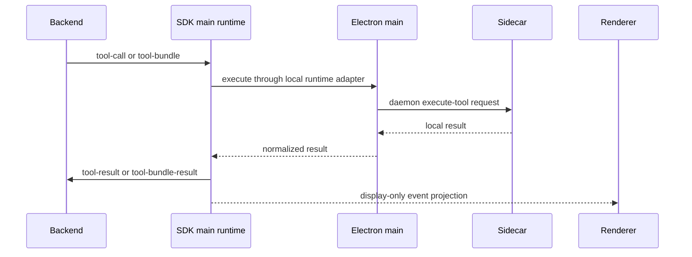

# Retired Renderer Tool Execution Runtime Reference

The renderer-side local tool runner has been deleted. Backend `tool-call` and
`tool-bundle` events are no longer executed from renderer hooks or renderer
services.

Current ownership:

- SDK main runtime owns backend websocket tool events, local execution
  coordination, stale execution guards, result envelope construction, and
  `tool-result` / `tool-bundle-result` delivery.
- Electron main owns the sidecar daemon bridge, local permissions, artifact
  upload plumbing, and display-only backend event fan-out.
- Python sidecar owns executable filesystem, shell, browser, computer-use, MCP,
  plugin, and extension tools.
- Renderer owns display projection only: tool-call cards, tool-output cards,
  transcript projection, stream phase, and visible status.

Deleted runtime modules included the old renderer hook, runner utilities, and
renderer execution service. Do not recreate them for backend-owned tool events.
If a custom client needs local execution, use the SDK runtime contracts instead.

## Current Tool Flow

## Replacement Owners

| Concern | Current owner |
| --- | --- |
| Backend tool event normalization | `packages/windie-sdk-js/src/index.ts`, `frontend/src/main/windie_sdk_runtime.cjs` |
| Local tool routing | `frontend/src/main/ipc/ipc_sdk_tool_router.cjs`, sidecar daemon bridge |
| Tool execution implementation | `frontend/src/main/python/tools/**` |
| Tool result ingress | backend incoming schemas and tool-result handlers |
| Tool-call/tool-output display | `frontend/src/renderer/features/chat/hooks/chatStream/useChatStreamToolHandlers.ts` and chat-stream tool message helpers |
| Transcript projection | renderer transcript infrastructure and SDK conversation-store projections |

## Debug Routing

- If the backend emitted a tool event but no local action happened, inspect the
  SDK main-runtime tool router and sidecar daemon status.
- If the sidecar ran but the model did not continue, inspect SDK result delivery,
  `request_id` / `bundle_id` preservation, and backend tool-result ingress.
- If the UI shows a confusing tool card, inspect renderer chat-stream tool
  display handlers and transcript projection.
- If duplicate execution happens, verify the renderer copy is display-only and
  that no renderer-side execution path was reintroduced.

Read next:

- [Sidecar and Tool Channels](../../../channels/sidecar_and_tool_channels.md)
- [Tool Execution Lifecycle](../../../tools/tool_execution_lifecycle.md)
- [Windie Client Runtime](../../../sdk/windie_client_runtime.md)
