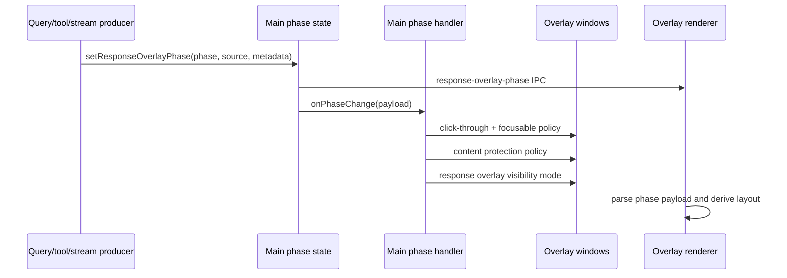

# Overlay Phase and Surface Change Workflow

Use this workflow before changing the minimal chat pill, response overlay, overlay
phase IPC, screenshot capture visibility, content protection, or tool surface
handoff behavior. These bugs usually look visual, but the owner is often the
main-process phase handler or platform capture policy rather than the React
component that happens to render the symptom.

## Non-Negotiable Contracts

- The loop phase is the source of truth for response overlay visibility,
  click-through state, focusability, and content protection.
- Active loop phases are `awaiting-first-chunk`, `streaming`, `tool-call`, and
  `tool-output`.
- Terminal or idle phases are `idle`, `complete`, and `error`.
- During active loop phases, Electron main keeps the chat pill, response overlay,
  and context label non-focusable and click-through.
- Renderer code must not directly own loop-wide interactivity toggles. Use the
  phase pipeline and main-process handlers.
- Linux is the only OS that should hide WindieOS overlay surfaces for screenshot
  capture and restore them afterward.
- macOS and Windows must not add capture-time hide/show for the minimal chat
  pill or response overlay; they rely on content protection during active phases.
- macOS and Windows content protection must be disabled again for idle,
  `complete`, and `error`.
- Minimal chat pill awaiting state must survive transient `idle` during
  cross-window timing, then clear on `streaming`, `complete`, `error`, or visible
  response content.
- Avoid focus-recovery hacks in renderer chat-pill code. If focus changes are
  needed, route them through Electron main/window policy.

## Fast Owner Map

| Change or symptom | Primary owner files | Tests to inspect or add |
| --- | --- | --- |
| Add, remove, or rename an overlay phase | `frontend/src/shared/response_overlay_phase_contract.json`, `frontend/src/main/ipc/ipc_overlay_phase_contract.cjs`, `frontend/src/renderer/features/chat/utils/overlay/responseOverlayPhaseContract.js` | `tests/frontend/OverlayPhaseContractParity.test.js`, `tests/frontend/IpcOverlayPhaseContract.test.cjs`, `tests/frontend/ResponseOverlayPhaseContract.test.js` |
| Phase event is ignored, malformed, or loses metadata | `frontend/src/main/ipc/ipc_overlay_phase_state.cjs`, `frontend/src/main/ipc/ipc_overlay_phase_events.cjs`, `frontend/src/renderer/features/chat/utils/overlay/responseOverlayPhasePayload.js`, `frontend/src/renderer/features/chat/utils/overlay/overlayPhaseListener.js` | `tests/frontend/IpcOverlayPhaseState.test.cjs`, `tests/frontend/IpcOverlayPhaseEvents.test.cjs`, `tests/frontend/ResponseOverlayPhasePayload.test.js`, `tests/frontend/OverlayPhaseListener.test.js` |
| Response overlay window shows/hides at wrong time | `frontend/src/main/response_overlay_phase_handler.cjs`, `frontend/src/main/response_overlay_visibility_policy.cjs`, `frontend/src/main/overlay_responsebox_handler.cjs` | `tests/frontend/ResponseOverlayPhaseHandler.test.cjs`, `tests/frontend/ResponseOverlayVisibilityPolicy.test.cjs`, `tests/frontend/OverlayResponseboxHandler.test.cjs` |
| Chat pill click-through or focusability is wrong | `frontend/src/main/response_overlay_phase_handler.cjs`, `frontend/src/main/overlay_chatbox_handler.cjs`, `frontend/src/main/surface_runtime.cjs`, `frontend/src/renderer/features/chat/components/ChatBox.jsx` | `tests/frontend/ChatBoxOverlayMouseIgnore.test.jsx`, `tests/frontend/OverlayChatboxHandler.test.cjs`, `tests/frontend/SurfaceRuntime.test.cjs` |
| Awaiting indicator flickers or sticks | `frontend/src/renderer/features/chat/components/ChatBoxResponse.jsx`, `frontend/src/renderer/features/chat/hooks/useResponseOverlayViewModel.js`, `frontend/src/renderer/features/chat/utils/overlay/responseOverlayLayoutMode.js`, `frontend/src/renderer/features/chat/utils/state/streamPhaseState.js` | `tests/frontend/ChatBoxResponse.state.test.jsx`, `tests/frontend/ResponseOverlayLayoutMode.test.js`, `tests/frontend/StreamPhaseState.test.js` |
| Screenshot captures WindieOS UI or hides surfaces on the wrong OS | `frontend/src/main/local_backend_bridge_execute_tool_runtime.cjs`, `frontend/src/main/local_backend_bridge_window_visibility.cjs`, `frontend/src/main/platform/screenshot_window_visibility/*`, `frontend/src/main/platform/content_protection/*`, renderer capture services for user-initiated attachments | `tests/frontend/LocalBackendBridgeExtensionRuntime.test.cjs`, `tests/frontend/SurfaceOrchestratorCaptureLifecycle.test.ts`, platform policy tests |
| Tool execution handoff leaves dashboard/pill in wrong state | `frontend/src/main/main_window_runtime.cjs`, `frontend/src/main/local_backend_bridge_execute_tool_runtime.cjs`, `frontend/src/main/window_visibility_runtime.cjs`, `frontend/src/main/overlay_visibility_handler.cjs`, `packages/windie-sdk-js/src/runtime/WindieDesktopAgent.ts` | `tests/frontend/LocalBackendBridgeExtensionRuntime.test.cjs`, `tests/frontend/OverlayVisibilityHandler.test.cjs`, `tests/frontend/ResponseOverlayPhaseHandler.test.cjs`, `tests/frontend/WindieSdkDesktopAgent.test.ts` |
| Window bounds, frame size, or drag anchor jumps | `frontend/src/main/overlay_bounds.cjs`, `frontend/src/main/overlay_chatbox_visual_anchor_handler.cjs`, `frontend/src/renderer/features/chat/utils/overlay/overlayFrameSize.js`, `frontend/src/renderer/features/chat/utils/chatbox/chatboxPillLayout.js` | `tests/frontend/OverlayBounds.test.cjs`, `tests/frontend/OverlayFrameSize.test.js`, `tests/frontend/ChatBoxPillLayout.test.js` |

## Phase Pipeline

## Change Sequence

### 1. Classify the change

Start by identifying the contract being changed:

- Phase contract: phase names, metadata keys, parser behavior, IPC payload shape.
- Main window policy: response overlay window visibility, click-through,
  focusable state, content protection, context label visibility.
- Renderer presentation: awaiting shell, response layout, frame measurement,
  thinking text, tool ghost preview, scroll state.
- Capture policy: screenshot hide/restore, dashboard-to-pill handoff,
  platform-specific visibility behavior.
- Geometry: overlay bounds, visual anchor, fixed frame sizes, drag behavior.

If the symptom spans more than one category, update the producer and policy docs
before changing presentation code.

### 2. Inspect phase producers

Common phase producers:

- query send accepted in `frontend/src/main/ipc/ipc_query_send_runtime.cjs`
- backend stream fan-out in `frontend/src/main/ipc.cjs`
- overlay phase helpers in `frontend/src/main/ipc/ipc_overlay_phase_events.cjs`
- renderer stream state projection in `frontend/src/renderer/features/chat/utils/state/streamPhaseState.js`
- SDK/main tool routing in `packages/windie-sdk-js/src/runtime/WindieDesktopAgent.ts` and
  `packages/windie-sdk-js/src/tools/ToolExecutionCoordinator.ts`
- main-process computer-use surface prep in
  `frontend/src/main/local_backend_bridge_execute_tool_runtime.cjs`
- renderer capture lifecycle transitions for user-initiated attachments in
  `frontend/src/renderer/infrastructure/services/SurfaceOrchestrator.ts`

Producer rules:

- Use only phases listed in `frontend/src/shared/response_overlay_phase_contract.json`.
- Preserve metadata keys through normalization when they are useful for tracing:
  `correlation_id`, `attempt`, `max_attempts`, `recovery_stage`,
  `failure_reason`.
- Preserve `correlation_id` on active-loop and terminal events whenever the
  backend event has a stable request, correlation, bundle, or event id. Main
  process phase application uses that value to reject stale terminal updates
  from older responses.
- Do not invent local-only phase strings in renderer code. Add contract tests if
  a new phase is truly required.

### 3. Inspect Electron main phase handling

Read these files before changing window visibility or interactivity:

- `frontend/src/main/response_overlay_phase_handler.cjs`
- `frontend/src/main/response_overlay_visibility_policy.cjs`
- `frontend/src/main/ipc/ipc_overlay_phase_state.cjs`
- `frontend/src/main/ipc/ipc_overlay_phase_contract.cjs`
- `frontend/src/main/overlay_responsebox_handler.cjs`
- `frontend/src/main/overlay_chatbox_handler.cjs`
- `frontend/src/main/overlay_visibility_handler.cjs`

Main-process rules:

- `resolveResponseOverlayWindowMode(...)` maps active phases to
  `active-loop`, `idle` to hidden, and terminal phases to terminal restore.
- `syncOverlayLoopInteractivity(...)` owns `setIgnoreMouseEvents(...)` and
  `setFocusable(...)` for chat, response, and context label windows.
- `syncOverlayContentProtection(...)` owns content protection for chat and
  response windows.
- The response overlay should be shown during active loop phases, hidden on
  idle, and restored after terminal phases only when the overlay was visible and
  the chat window is still visible.
- Terminal/idle phases with a mismatched active response `correlation_id` must
  be ignored so late events from a previous response cannot mutate the current
  overlay visibility, interactivity, or content-protection state.
- Preserve debug trace fields when changing handler order so phase regressions
  can be reconstructed from logs.

### 4. Inspect renderer overlay presentation

Read these files before changing what the user sees:

- `frontend/src/renderer/app/ChatBoxApp.jsx`
- `frontend/src/renderer/app/ChatBoxResponseApp.jsx`
- `frontend/src/renderer/features/chat/components/ChatBox.jsx`
- `frontend/src/renderer/features/chat/components/ChatBoxResponse.jsx`
- `frontend/src/renderer/features/chat/hooks/useResponseOverlayPhase.js`
- `frontend/src/renderer/features/chat/hooks/useResponseOverlayViewModel.js`
- `frontend/src/renderer/features/chat/hooks/useResponseOverlayWindowSync.js`
- `frontend/src/renderer/features/chat/utils/overlay/*`
- `frontend/src/renderer/styles/ChatBox.css`
- `frontend/src/renderer/styles/ChatBoxResponseOverlay.css`

Renderer rules:

- Parse phase IPC through `parseResponseOverlayPhasePayload(...)` and
  `overlayPhaseListener.js`.
- Derive visible layout from phase plus current message state. Do not add timers
  that compete with stream state.
- Keep `awaiting-typing` and `response` frame sizes stable. Avoid per-token
  resize churn.
- Keep awaiting-to-response transitions non-animated in the minimal pill loop.
- Tool ghost preview is display-only. Local tool execution remains in the SDK
  runtime, Electron main bridge, and sidecar tools.

### 5. Inspect platform capture behavior

Read these files before changing screenshot or content-protection behavior:

- `frontend/src/main/local_backend_bridge_execute_tool_runtime.cjs`
- `frontend/src/main/local_backend_bridge_window_visibility.cjs`
- `frontend/src/main/window_visibility_runtime.cjs`
- `frontend/src/main/overlay_visibility_handler.cjs`
- `frontend/src/main/platform/screenshot_window_visibility/*`
- `frontend/src/main/platform/content_protection/*`
- `frontend/src/renderer/infrastructure/services/SurfaceOrchestrator.ts` for
  renderer-initiated attachment capture flows

Platform rules:

- Linux overlay screenshot capture uses hide/restore through the shared surface
  orchestration path.
- macOS and Windows overlay screenshot capture should not hide/show the minimal
  pill or response overlay.
- macOS and Windows content protection should be enabled only while the loop is
  active and disabled for idle/terminal phases.
- Dashboard-originated computer-use should hand off to the minimal pill in
  Electron main before SDK/main invokes the sidecar executor.
- Surface restore should not steal focus.

## Debug Routes

| Symptom | First checks | Likely owner |
| --- | --- | --- |
| Response overlay never appears | Confirm main receives `awaiting-first-chunk` or `streaming`, then check window mode resolution and renderer phase parser. | `ipc_overlay_phase_state.cjs`, `response_overlay_phase_handler.cjs`, overlay listener |
| Response overlay stays after completion | Check terminal phase handling, visible-state restore policy, and renderer layout mode. | `response_overlay_visibility_policy.cjs`, `ChatBoxResponse.jsx` |
| Awaiting dots flicker after screenshot | Check Linux hide-only collapse path, transient `idle` latch, and response content visibility clear. | local-backend surface prep, `streamPhaseState.js`, response overlay view model |
| Chat pill blocks clicks during idle | Check active-loop interactivity decision and chatbox hit-test active state. | `response_overlay_phase_handler.cjs`, `overlay_chatbox_handler.cjs` |
| Screenshot includes WindieOS UI on Linux | Check surface visibility prepare/restore path and compositor settle timing. | local-backend surface prep, renderer attachment capture lifecycle, and Linux surface visibility |
| Screenshot hides WindieOS UI on macOS/Windows | Remove capture-time hide/show path and verify content-protection policy instead. | platform surface visibility and content protection |
| Focus jumps after tool screenshot | Check for renderer focus hacks or platform restore calls outside main/window policy. | local-backend surface prep and main window policy |
| Overlay frame jumps while streaming | Check frame-size reporting, layout mode, fixed height contracts, and per-token resize paths. | `overlayFrameSize.js`, `responseOverlayLayoutMode.js`, CSS |

## Validation Matrix

Docs-only change:

- `./bin/docs-list`
- `git diff --check`
- focused Markdown link check for touched docs

Phase contract or payload change:

- `cd frontend && npm run test -- OverlayPhaseContractParity`
- `cd frontend && npm run test -- IpcOverlayPhaseContract`
- `cd frontend && npm run test -- ResponseOverlayPhasePayload`
- `cd frontend && npm run test -- OverlayPhaseListener`

Main-process phase/window policy change:

- `cd frontend && npm run test -- ResponseOverlayPhaseHandler`
- `cd frontend && npm run test -- ResponseOverlayVisibilityPolicy`
- `cd frontend && npm run test -- IpcOverlayPhaseState`
- `cd frontend && npm run test -- IpcOverlayPhaseEvents`

Renderer overlay presentation change:

- `cd frontend && npm run test -- ChatBoxResponse`
- `cd frontend && npm run test -- ResponseOverlayLayoutMode`
- `cd frontend && npm run test -- OverlayFrameSize`
- `cd frontend && npm run test -- ChatBoxPillLayout`

Capture/platform behavior change:

- `cd frontend && npm run test -- LocalBackendBridgeExtensionRuntime`
- `cd frontend && npm run test -- OverlayVisibilityHandler`
- `cd frontend && npm run test -- SurfaceOrchestratorCaptureLifecycle`
- platform-specific manual screenshot check on the affected OS

## Docs to Sync

Update these docs when overlay phase or surface policy changes:

- [Frontend Runtime Invariants and PR Checklist](frontend_runtime_invariants_checklist.md)
- [Minimal Chat Pill](../../desktop/minimal_chat_pill.md)
- [Response Overlay](../../desktop/response_overlay.md)
- [Screenshot and Overlay Policy](../../platforms/screenshot_overlay_policy.md)
- [Frontend Response Overlay Phase and Tool-Ghost Runtime Reference](../renderer/overlays/response_overlay_phase_and_tool_ghost_runtime_reference.md)
- [Frontend Chatbox Overlay Input, Drag, and Click-Through Reference](../renderer/overlays/chatbox_overlay_input_drag_and_clickthrough_reference.md)
- [Frontend Overlay + Wakeword Control Channel Reference](../contracts/overlay_and_wakeword_control_channel_reference.md)
- [Query Send and Stream Relay Change Workflow](../main/query_send_and_stream_relay_change_workflow.md)
- [Platform Change Workflow](../../platforms/platform_change_workflow.md)
