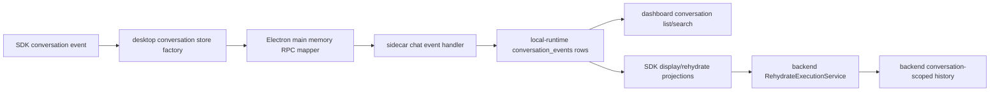

# Transcript Replay Change Workflow

Use this workflow for the visible-chat projection path. WindieOS transcript replay is related to memory, but it is not the same thing as semantic memory or backend active model history.

The core rule is: SDK local-runtime `conversation_events` rows are the canonical client-runtime state. Visible transcript rows are projections persisted for display/search, and backend active history is rebuilt from SDK rehydrate projections before resume. Fix display and replay at the SDK projection/store layer. Fix resumed model context at the rehydrate projection layer. Fix derived memory search/semantic facts in sidecar memory and semanticization code.

## Runtime Path

## Boundary Rules

- SDK projection/runtime code owns visible chat projection, local replay snapshots, and the rehydrate payload assembled from stored conversation events.
- Electron main owns IPC/RPC mapping and identity sync between windows. It should not interpret chat semantics beyond normalizing bridge payload keys and forwarding session updates.
- The SDK local-runtime store owns durable local row storage, conversation list/search/title/delete queries, message-index ordering, and transcript-window APIs; the Python sidecar implements the current SQLite backing store.
- Backend rehydrate owns conversion from stored transcript entries into
  model-compatible backend history. It normalizes current transcript
  projections and rejects missing or stale tool linkage instead of repairing or
  synthesizing provider history.
- Backend active history is not the source of dashboard conversation list truth. Do not patch backend history to make a missing sidebar conversation appear.
- Semantic memory is derived from transcript/interaction rows. Do not edit semantic memory as a shortcut for fixing replay or visible transcript bugs.
- `conversationRef`/`conversation_id`, `userId`/`user_id`, role, message type, timestamp, message index, tool identifiers, and screenshot refs must survive any row that can be replayed or rehydrated later.

## Fast Owner Map

| Symptom | First owner | Inspect first | Then inspect |
| --- | --- | --- | --- |
| User or assistant row appears in UI but is missing after restart | SDK store/display projection | `desktopConversationStore.ts`, `sdkDisplayChatMessageProjection.ts`, SDK conversation runtime/store | `DesktopConversationStore.test.ts`, `SdkDisplayChatMessageProjection.test.ts`, sidecar `conversation.append_event` tests |
| Tool call or tool output is missing, duplicated, or reordered after replay | Renderer transcript tool message state and SDK display projection | `toolCallMessageState.js`, `toolOutputChatMessageState.ts`, `sdkDisplayChatMessageProjection.ts`, replay tool helpers | `ConversationReplayToolMessages.test.js`, `SdkDisplayChatMessageProjection.test.ts`, backend linkage validation tests |
| Transcript writes happen under the wrong conversation | Transcript session runtime and Electron sync | `transcriptSessionRuntime.ts`, `sessionInfoState.ts`, `sessionSyncPayload.ts`, `frontend/src/main/ipc/ipc_transcript_session_sync.cjs` | [Session and Conversation Identity Change Workflow](session_conversation_identity_change_workflow.md) |
| Dashboard conversation list is missing, stale, or ordered wrong | Sidecar conversation storage plus dashboard loader | `frontend/src/main/python/memory/chat_event_store.py`, `local_store.py`, dashboard conversation hooks | `tests/sidecar/test_chat_event_store.py`, `tests/frontend/DashboardConversationLoad.test.js` |
| Dashboard resume displays wrong rows | SDK display projection and conversation load command | `desktopConversationContinuityService.ts`, `desktopConversationStore.ts`, SDK conversation store/runtime | `DesktopConversationContinuityService.test.ts`, `DesktopConversationStore.test.ts` |
| Resume displays rows but backend answers without old context | SDK rehydrate projection and backend rehydrate service | `packages/windie-sdk-js/src/projections/conversationProjections.ts`, `packages/windie-sdk-js/src/runtime/ConversationContinuityService.ts`, `backend/src/api/handlers/rehydrate.py`, `backend/src/api/services/rehydrate_*` | `WindieSdkConversationRuntime.test.ts`, `ConversationContinuityService.test.ts`, backend rehydrate service/linkage tests |
| Transparency/system-prompt rows replay incorrectly | SDK projections and backend rehydrate transparency resolution | `chatStreamMessageUpdates.ts`, `packages/windie-sdk-js/src/projections/conversationProjections.ts`, `backend/src/api/services/rehydrate_transparency_resolution.py` | SDK rehydrate projection tests, `tests/backend/test_rehydrate_transparency_resolution.py` |
| Conversation delete leaves rows, titles, or search results behind | Sidecar memory delete/cleanup plus renderer active-chat reset | `local_store.py`, conversation delete helpers, dashboard delete actions | `tests/sidecar/test_local_store_delete_cleanup.py`, conversation title/list tests, dashboard delete tests |
| Search returns rows from the wrong conversation | Sidecar conversation search | `conversation_search_helpers.py`, `local_store.py` | `tests/sidecar/test_conversation_search*.py` |

## Change Sequence

1. Identify the failing phase.
   - Store: row crosses renderer IPC, Electron main, sidecar handler, and SQLite.
   - List/search: dashboard asks sidecar for conversations.
   - Replay: stored rows become visible chat messages.
   - Rehydrate: stored rows become backend model history.

2. Check identity before changing storage shape.
   - If `conversationRef`, `userId`, or `turn_ref` is wrong, switch to [Session and Conversation Identity Change Workflow](session_conversation_identity_change_workflow.md).
   - If the identity is right but the row is missing or malformed, continue here.

3. Trace the store path.
   - Chat stream handlers consume SDK conversation events and active-turn projections.
   - Desktop conversation store calls cross Electron main into the sidecar storage boundary.
   - Main process maps payload keys before calling sidecar JSON-RPC.
   - Sidecar `conversation.append_event` normalizes and stores rows in `LocalMemoryStore`.

4. Preserve replay shape.
   - Stored transcript rows must reconstruct stable user, assistant, tool-call, tool-output, bundle, transparency, screenshot, and model metadata rows.
   - Replay should not invent backend-only history fields for UI display.
   - Local snapshots should not replace durable transcript storage unless the code explicitly uses them as a fallback.
   - Edit/resend and try-again must cut by canonical SDK event or payload
     message id. Do not restore user-message ordinal fallback or latest-user
     retry fallback for renderer-only transcript ids.

5. Preserve rehydrate shape.
   - SDK `buildRehydrateSnapshot(...)` should emit backend-compatible entries
     from stored conversation events, including canonical stored
     `message_type` values such as `user_query`, `assistant_response`, and
     `tool_output`.
   - Backend rehydrate should normalize message roles, structured tool
     payloads, transparency rows, screenshot refs, and tool-call/tool-output
     linkage, while rejecting stale message-type aliases at the API boundary.
   - Provider-strict history should be rejected at the backend rehydrate layer when
     current transcript projections omit required tool linkage or structured tool
     payloads.

6. Update docs next to behavior.
   - Update this workflow when transcript/replay ownership or sequencing changes.
   - Update [Transcript and Replay](transcript_and_replay.md) for high-level behavior.
   - Update [Frontend Renderer Transcript Docs Hub](../frontend/renderer/transcript/README.md) and focused renderer transcript references for renderer internals.
   - Update [Memory Change Workflow](memory_change_workflow.md) for cross-layer routing.
   - Update [Session and Conversation Identity Change Workflow](session_conversation_identity_change_workflow.md) if identity fields or filtering rules change.
   - Update [Session and Transcript Reference](../reference/session_and_transcript_reference.md) if identifier contracts change.

## Validation Matrix

| Change type | Focused validation |
| --- | --- |
| Stored-row conversion to visible chat messages | `<windie> test frontend -- SdkDisplayChatMessageProjection DesktopConversationContinuityService DesktopConversationStore` |
| Transcript session identity or sync payloads | `<windie> test frontend -- TranscriptSessionState TranscriptSessionSyncPayload IpcTranscriptSessionSync` |
| Dashboard resume actions | `<windie> test frontend -- ConversationReplayActions DashboardConversationLoad DesktopConversationStore UseDashboardConversations` |
| Rehydrate payload construction | `<windie> test frontend -- WindieSdkConversationRuntime ConversationContinuityService ConversationReplayToolMessages` |
| Backend rehydrate normalization/linkage/transparency | `./scripts/python-in-env backend pytest tests/backend/test_rehydrate_execution_service.py tests/backend/test_rehydrate_tool_call_normalization.py tests/backend/test_rehydrate_tool_linkage.py tests/backend/test_rehydrate_transparency_resolution.py` |
| Sidecar transcript storage/list/window/delete | `./scripts/python-in-env sidecar pytest tests/sidecar/test_chat_event_store.py tests/sidecar/test_conversation_window_runtime.py tests/sidecar/test_local_store_delete_cleanup.py` |
| Sidecar conversation search | `./scripts/python-in-env sidecar pytest tests/sidecar/test_conversation_search_helpers.py tests/sidecar/test_chat_event_store.py tests/sidecar/test_conversation_window_runtime.py` |
| Docs-only transcript workflow | `<windie> docs list`, `git diff --check`, focused Markdown link check |

## Debug Playbooks

### Visible Row Missing After Restart

1. Confirm the row was emitted as an SDK conversation event.
2. Confirm renderer IPC called the main memory bridge with the expected payload.
3. Confirm sidecar `conversation.append_event` wrote a row with the expected user/conversation/message type.
4. Confirm dashboard/list replay is querying the same user and conversation.
5. Confirm SDK display projection maps the stored event into the expected chat row.

### Replay Loses Tool Rows

1. Confirm tool-call and tool-output transcript rows were both persisted.
2. Confirm tool call ids, request ids, correlation ids, and structured payloads were stored.
3. Inspect replay tool-message reconstruction before changing backend rehydrate code.
4. If the UI replay is correct but backend context is wrong, inspect backend rehydrate linkage validation.
5. Add both a renderer replay test and a backend rehydrate linkage test when a row crosses both boundaries.

### Dashboard Resume Shows the Right Rows but Backend Forgets Context

1. Confirm SDK display projections render the intended rows.
2. Confirm SDK `buildRehydrateSnapshot(...)` includes those rows in backend-compatible order.
3. Confirm the rehydrate request uses the selected `conversation_ref`.
4. Confirm backend `RehydrateExecutionService` installs history into the conversation-scoped session.
5. Confirm the next query uses the same `conversation_ref`.

### Conversation Search Finds the Wrong Rows

1. Confirm the search command passes the intended `user_id`.
2. Confirm sidecar search SQL filters by conversation and user.
3. Confirm display projection does not merge rows from multiple conversations after search.
