# Transcript Replay Change Workflow

Use this workflow for the visible-chat projection path. WindieOS transcript replay is related to memory, but it is not the same thing as semantic memory or backend active model history.

The core rule is: sidecar `chat_events` rows are the canonical client-runtime state. Visible transcript rows are projections persisted for display/search, and backend active history is rebuilt from SDK rehydrate projections before resume. Fix display and replay at the SDK projection/store layer. Fix resumed model context at the rehydrate projection layer. Fix derived memory search/semantic facts in sidecar memory and semanticization code.

## Runtime Path

```mermaid
flowchart LR
    A["Chat stream or local user/tool event"] --> B["DesktopConversationRuntimeClient"]
    B --> C0["Desktop conversation continuity service"]
    C0 --> C{"session identity ready?"}
    C -- "yes" --> D["DesktopConversationStoreAdapter"]
    C -- "no" --> E["pending event queues"]
    E --> D
    D --> G["Electron main memory RPC mapper"]
    G --> H["sidecar store_chat_event handler"]
    H --> I["sidecar chat_events rows"]
    I --> J["dashboard conversation list/search"]
    I --> K["SDK display/rehydrate projections"]
    K --> L["rehydratePayload.js"]
    L --> M["backend RehydrateExecutionService"]
    M --> N["backend conversation-scoped history"]
```

## Boundary Rules

- SDK projection/runtime code owns visible chat projection recording, pending retry queues, local replay snapshots, and the rehydrate payload assembled from stored conversation events.
- Electron main owns IPC/RPC mapping and identity sync between windows. It should not interpret chat semantics beyond normalizing bridge payload keys and forwarding session updates.
- The sidecar owns durable local row storage, conversation list/search/title/delete queries, message-index ordering, and transcript-window APIs.
- Backend rehydrate owns conversion from stored transcript entries into model-compatible backend history. It may normalize, repair, prune, or synthesize tool linkage only to preserve provider-valid history.
- Backend active history is not the source of dashboard conversation list truth. Do not patch backend history to make a missing sidebar conversation appear.
- Semantic memory is derived from transcript/interaction rows. Do not edit semantic memory as a shortcut for fixing replay or visible transcript bugs.
- `conversationRef`/`conversation_id`, `userId`/`user_id`, role, message type, timestamp, message index, tool identifiers, and screenshot refs must survive any row that can be replayed or rehydrated later.
- Transcript writes must remain best-effort and retryable. A temporary sidecar/IPC failure should queue or requeue a transcript record, not silently drop the row.

## Fast Owner Map

| Symptom | First owner | Inspect first | Then inspect |
| --- | --- | --- | --- |
| User or assistant row appears in UI but is missing after restart | Renderer projection runtime/pending queues | `frontend/src/renderer/app/runtime/desktopTranscriptProjectionRuntimeClient.ts`, `transcriptRecordWrite.ts`, `pending/*` | `tests/frontend/DesktopTranscriptProjectionRuntimeClient.test.ts`, `TranscriptPending*.test.ts`, sidecar `store_chat_event` tests |
| Tool call or tool output is missing, duplicated, or reordered after replay | Renderer transcript tool message state | `toolCallMessageState.js`, `toolOutputChatMessageState.ts`, `structuredToolPayload.js`, replay tool helpers | `tests/frontend/DesktopTranscriptProjectionRuntimeClient.test.ts`, `ConversationReplayToolMessages.test.js`, backend linkage repair tests |
| Transcript writes happen under the wrong conversation | Transcript session runtime and Electron sync | `transcriptSessionRuntime.ts`, `sessionInfoState.ts`, `sessionSyncPayload.ts`, `frontend/src/main/ipc/ipc_transcript_session_sync.cjs` | [Session and Conversation Identity Change Workflow](session_conversation_identity_change_workflow.md) |
| Pending transcript rows never flush | Renderer pending queues | `pending/pendingTranscriptMessages.ts`, `pending/transcriptPendingFlush.ts`, `desktopTranscriptProjectionRuntimeClient.ts` | `tests/frontend/TranscriptPendingQueue.test.ts`, `TranscriptPendingFlush.test.ts`, `TranscriptPendingMessages.test.ts` |
| Dashboard conversation list is missing, stale, or ordered wrong | Sidecar conversation storage plus dashboard loader | `frontend/src/main/python/memory/conversation_list_runtime.py`, `local_store.py`, dashboard conversation hooks | `tests/sidecar/test_conversation_list_runtime.py`, `tests/frontend/DashboardConversationLoad.test.js` |
| Dashboard resume displays wrong rows | SDK display projection and sidecar transcript-window query | `conversationLocalSnapshotLoader.ts`, `storedTranscriptChatMessageState.js`, sidecar transcript-window runtime | `ConversationLocalSnapshotLoader.test.ts`, sidecar conversation-window tests |
| Resume displays rows but backend answers without old context | Rehydrate payload and backend rehydrate service | `rehydratePayload.js`, `backend/src/api/handlers/rehydrate.py`, `backend/src/api/services/rehydrate_*` | `RehydratePayload.test.js`, backend rehydrate service/linkage tests |
| Transparency/system-prompt rows replay incorrectly | Renderer transparency normalization and backend rehydrate transparency resolution | `transparencyNormalization.ts`, `backend/src/api/services/rehydrate_transparency_resolution.py` | `TranscriptTransparencyNormalization.test.ts`, `tests/backend/test_rehydrate_transparency_resolution.py` |
| Conversation delete leaves rows, titles, or search results behind | Sidecar memory delete/cleanup plus renderer active-chat reset | `local_store.py`, conversation delete helpers, dashboard delete actions | `tests/sidecar/test_local_store_delete_cleanup.py`, conversation title/list tests, dashboard delete tests |
| Search returns rows from the wrong conversation | Sidecar conversation search | `conversation_search_runtime.py`, `conversation_search_helpers.py`, `local_store.py` | `tests/sidecar/test_conversation_search*.py` |

## Change Sequence

1. Identify the failing phase.
   - Write: row is created or queued.
   - Store: row crosses renderer IPC, Electron main, sidecar handler, and SQLite.
   - List/search: dashboard asks sidecar for conversations.
   - Replay: stored rows become visible chat messages.
   - Rehydrate: stored rows become backend model history.

2. Check identity before changing storage shape.
   - If `conversationRef`, `userId`, or `turn_ref` is wrong, switch to [Session and Conversation Identity Change Workflow](session_conversation_identity_change_workflow.md).
   - If the identity is right but the row is missing or malformed, continue here.

3. Trace the write path.
   - Chat stream handlers and local send code call `DesktopConversationRuntimeClient`.
   - `DesktopTranscriptProjectionRuntimeClient` resolves session identity, writes immediately when possible, or queues into pending transcript queues.
   - `transcriptRecordWrite.ts` and `transcriptEntryPersistence.ts` shape the persisted entry.
   - Renderer IPC invokes the main memory bridge.
   - Main process maps payload keys before calling sidecar JSON-RPC.
   - Sidecar `store_chat_event` normalizes and stores rows in `LocalMemoryStore`.

4. Preserve pending-queue guarantees.
   - If session identity is unavailable, queue rows instead of dropping them.
   - If a store call fails transiently, requeue the row in the right category.
   - Preserve FIFO order inside each pending queue.
   - Flush user, assistant, and tool queues in the order documented by renderer transcript references.

5. Preserve replay shape.
   - Stored transcript rows must reconstruct stable user, assistant, tool-call, tool-output, bundle, transparency, screenshot, and model metadata rows.
   - Replay should not invent backend-only history fields for UI display.
   - Local snapshots should not replace durable transcript storage unless the code explicitly uses them as a fallback.

6. Preserve rehydrate shape.
   - `rehydratePayload.js` should emit backend-compatible entries from stored transcript rows.
   - Backend rehydrate should normalize message roles, structured tool payloads, transparency rows, screenshot refs, and tool-call/tool-output linkage.
   - Provider-strict history should be repaired at the backend rehydrate layer, not by hiding rows in the dashboard.

7. Update docs next to behavior.
   - Update this workflow when transcript/replay ownership or sequencing changes.
   - Update [Transcript and Replay](transcript_and_replay.md) for high-level behavior.
   - Update [Frontend Renderer Transcript Docs Hub](../frontend/renderer/transcript/README.md) and focused renderer transcript references for renderer internals.
   - Update [Memory Change Workflow](memory_change_workflow.md) for cross-layer routing.
   - Update [Session and Conversation Identity Change Workflow](session_conversation_identity_change_workflow.md) if identity fields or filtering rules change.
   - Update [Session and Transcript Reference](../reference/session_and_transcript_reference.md) if identifier contracts change.

## Validation Matrix

| Change type | Focused validation |
| --- | --- |
| Transcript projection user/assistant/tool recording | `cd frontend && npm run test -- DesktopTranscriptProjectionRuntimeClient TranscriptRecordWrite` |
| Transcript session identity or sync payloads | `cd frontend && npm run test -- TranscriptSessionState TranscriptSessionSyncPayload IpcTranscriptSessionSync` |
| Pending queue/retry behavior | `cd frontend && npm run test -- TranscriptPendingQueue TranscriptPendingFlush TranscriptPendingMessages` |
| Stored-row conversion to visible chat messages | `cd frontend && npm run test -- StoredTranscriptChatMessageState StoredTranscriptMemoryState ConversationReplayState ConversationLocalSnapshotLoader` |
| Dashboard resume actions | `cd frontend && npm run test -- ConversationReplayActions DashboardConversationLoad LocalConversationStore` |
| Rehydrate payload construction | `cd frontend && npm run test -- RehydratePayload ConversationReplayToolMessages` |
| Backend rehydrate normalization/linkage/transparency | `./scripts/python-in-env backend pytest tests/backend/test_rehydrate_execution_service.py tests/backend/test_rehydrate_tool_call_normalization.py tests/backend/test_rehydrate_tool_linkage_repair.py tests/backend/test_rehydrate_transparency_resolution.py` |
| Sidecar transcript storage/list/window/delete | `./scripts/python-in-env sidecar pytest tests/sidecar/test_conversation_list_runtime.py tests/sidecar/test_conversation_window_runtime.py tests/sidecar/test_conversation_titles.py tests/sidecar/test_local_store_delete_cleanup.py` |
| Sidecar conversation search | `./scripts/python-in-env sidecar pytest tests/sidecar/test_conversation_search.py tests/sidecar/test_conversation_search_runtime.py tests/sidecar/test_conversation_search_helpers.py` |
| Docs-only transcript workflow | `./bin/docs-list`, `git diff --check`, focused Markdown link check |

## Debug Playbooks

### Visible Row Missing After Restart

1. Confirm the row was passed to `DesktopConversationRuntimeClient` / `DesktopTranscriptProjectionRuntimeClient`.
2. Confirm session identity was ready or the row entered a pending queue.
3. Confirm immediate store failure requeued the row.
4. Confirm renderer IPC called the main memory bridge with the expected payload.
5. Confirm sidecar `store_chat_event` wrote a row with the expected user/conversation/message type.
6. Confirm dashboard/list replay is querying the same user and conversation.

### Replay Loses Tool Rows

1. Confirm tool-call and tool-output transcript rows were both persisted.
2. Confirm tool call ids, request ids, correlation ids, and structured payloads were stored.
3. Inspect replay tool-message reconstruction before changing backend rehydrate code.
4. If the UI replay is correct but backend context is wrong, inspect backend rehydrate linkage repair.
5. Add both a renderer replay test and a backend rehydrate linkage test when a row crosses both boundaries.

### Dashboard Resume Shows the Right Rows but Backend Forgets Context

1. Confirm SDK display projections render the intended rows.
2. Confirm `rehydratePayload.js` includes those rows in backend-compatible order.
3. Confirm the rehydrate request uses the selected `conversation_ref`.
4. Confirm backend `RehydrateExecutionService` installs history into the conversation-scoped session.
5. Confirm the next query uses the same `conversation_ref`.

### Conversation Search Finds the Wrong Rows

1. Confirm dashboard search passes the expected user id and query.
2. Inspect sidecar search target planning and grouped conversation hits.
3. Confirm lexical and semantic search paths apply conversation filters consistently.
4. Confirm vector mapping/index rebuild behavior before changing renderer search UI.

### Delete Leaves Stale Conversation Data

1. Confirm renderer clears active replay state if deleting the active conversation.
2. Confirm sidecar deletes transcript rows and conversation title rows for the same user/conversation.
3. Confirm FAISS artifacts are rebuilt or cleaned when no indexed rows remain.
4. Confirm dashboard list/search refreshes after deletion.

## Review Checklist

- Visible transcript persistence, replay, and backend rehydrate remain separate responsibilities.
- Failed stores queue or requeue instead of dropping transcript rows.
- Tool-call/tool-output linkage fields survive persistence, replay, and rehydrate.
- Renderer and backend both preserve screenshot refs and transparency metadata where applicable.
- Dashboard list/search/delete behavior uses the same user/conversation keys as transcript writes.
- Rehydrate does not mutate durable sidecar storage just to repair provider history.
- Tests cover the producer and consumer whenever a persisted row shape changes.

## Related Docs

- [Memory Change Workflow](memory_change_workflow.md)
- [Transcript and Replay](transcript_and_replay.md)
- [Session and Conversation Identity Change Workflow](session_conversation_identity_change_workflow.md)
- [Session and Transcript Reference](../reference/session_and_transcript_reference.md)
- [Frontend Renderer Transcript Docs Hub](../frontend/renderer/transcript/README.md)
- [Frontend Transcript Session and Rehydrate Runtime](../frontend/renderer/transcript_session_and_rehydrate_reference.md)
- [IPC Event Replay and Transcript Session Sync Reference](../frontend/main/ipc_event_replay_and_transcript_session_sync_reference.md)
- [Sidecar Local Memory](sidecar_local_memory.md)
- [Backend History and Semantic Routes](backend_history_and_semantic_routes.md)
